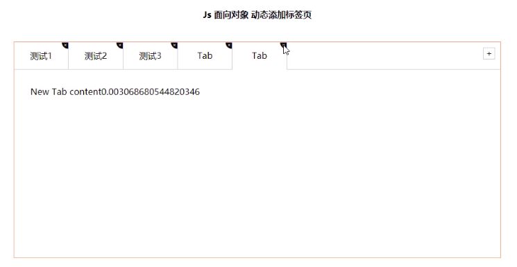

[toc]
# 一. 面向对象编程介绍 
>能够说出什么是面向对象
能够说出类和对象的关系
能够使用class创建自定义类
能够说出什么是继承

## 1.1 两大编程思想

### 1.面向过程编程POP
面向过程，就是按照我们分析好了的步骤，按照步骤解决问题。
对于编程，就是分析出解决问题所需要的步骤,然后用函数把这些步骤一步一步实现 ,使用的时候再一个一 个的依次调用就可以了。

>举个栗子:将大象装进冰箱
面向过程做法： 1.打开冰箱门  2.大象装进去  3.关上冰箱门

### 2.面向对象编程OOP
面向对象是把事务分解成为一个个对象,然后由对象之间分工与合作。是以对象功能来划分问题，而不是步骤。
在面向对象程序开发思想中,每一个对象都是功能中心,具有明确分工。
>举个栗子:将大象装进冰箱
面向对象做法： 1.大象对象 -进去      2.  冰箱对象  -打开  -关闭


面向对象编程具有灵活、代码可复用、容易维护和开发的优点,更适合多人合作的大型软件项目。
面向对象的特性:   封装性  继承性  多态性

### 3.面向过程和面向对象的对比
面向过程
>优点：性能比面向对象高，适合跟硬件联系很紧密的东西,
缺点：不易维护、不易复用、不易扩展。

面向对象
>优点：易维护、易复用、易扩展，由于面向对象有封装、继承、多态性的特性，可以设计出低耦合的系统，使系统 更加灵活、更加易于维护，
缺点：性能比面向过程低。

# 二. ES6中的类和对象
- 面向对象的思维特点:
    抽取(抽象)对象共用的属性和行为组织(封装)成一个类(模板)
    对类进行实例化,获取类的对象

- 面向对象编程：
我们考虑的是有哪些对象,按照面向对象的思维特点不断的创建对象、使用对象、指挥对象做事情。

## 2.1 对象
现实生活中, 万物皆对象,对象是一个具体的事物,看得见摸得着的实物。
在JavaScript中, 对象是一组无序的相关属性和方法的集合,所有的事物都是对象,例如字符串、数值、数组、函数等。

对象是由属性和方法组成的：
- 属性:事物的特征,在对象中用属性来表示(常用名词)
- 方法:事物的行为,在对象中用方法来表示(常用动词)
  
## 2.2 类 class
类, 抽象了对象的公共部分,它泛指某一大类( class)
对象, 特指某一个，通过类实例化一个具体的对象

## 2.3 创建类 
语法：
```javascript
class name {
          //class body
      }
```
创建实例：
```javascript
var xx = new name();
```

## 2.4 类 constructor 构造函数 
constructor() 方法是类的构造函数(默认方法)，用于传递参数,返回实例对象，
通过 new 命令生成对象实例时，自动调用该方法。
如果没有显示定义, 类内部会自动给我们创建一个constructor()。

```javascript
<script>
        //1.创建类 class 创建一个明星类
        class Star {
            constructor(uname,age){//类里面的构造函数
                this.uname = uname;
                this.age = age;
            }
        }
        //2.利用类创建对象new
        var ldh= new Star('刘德华',18);
        var zxy= new Star('张学友',20);
        console.log(ldh);
        console.log(zxy);
</script>
```
```javascript
1. 通过 class 关键字创建类，类名我们还是习惯性定义首字母大写
2. 类里面有个 constructor 函数，可以接收传递过来的参数，同时返回实例对象
3. constructor 函数只要 new 生成实例时，就会自动调用这个函数，如果我们不写这个函数，类也会自动生成这个函数
4. 生成实例 new 不能省略
5. 最后注意语法规范，创建类--类名后面不要加小括号，生成实例--类名后面加小括号，构造函数不需要加 function 关键字
```

## 2.5 类中添加方法 
语法规范：
```javascript
 //1.创建类 class 创建一个明星类
        class Star {
            //类的共有属性放到 constructor 里面
            constructor(uname,age){//类里面的构造函数
                this.uname = uname;
                this.age = age;
            }
            say(){
                console.log(this.uname + '你好');
            }
        }
```
示例：
```javascript
    <script>
        //1.创建类 class 创建一个明星类
        class Star {
            //类的共有属性放到 constructor 里面
            constructor(uname,age){//类里面的构造函数
                this.uname = uname;
                this.age = age;
            }
            say(){
                console.log(this.uname + '你好');
            }
            sing(song){
                console.log(this.uname + song);
            }
        }
        //2.利用类创建对象new
        var ldh= new Star('刘德华',18);
        var zxy= new Star('张学友',20);
        console.log(ldh);
        console.log(zxy);
 
        //我们类里面所有的函数不需要写function
        //多个函数方法之间不需要添加逗号分割
        ldh.say();
        zxy.say();
        ldh.sing('冰雨');
    </script>
```

# 三. 类的继承 

## 3.1 继承
现实中的继承：子承父业，比如我们都继承了父亲的姓。
程序中的继承：子类可以继承父类中的一些属性和方法。

语法：
```javascript
class Father{//父类
        }
class Son extends Father{//子类继承父类
        }
```
示例：
```javascript
class Father{//父类
        constructor(){
 
        }
        money(){
            console.log(100);
        }
}
class Son extends Father{//子类继承父类

        }
var son = new Son();
    son.money();
```

## 3.2 super关键字 
super 关键字用于访问和调用对象父类上的函数，可以调用父类的构造函数，也可以调用父类的普通函数。

### 1. super 关键字 调用父类的构造函数
```javascript
 class Father {
            constructor(x,y){
                this.x = x;
                this.y = y;
            }
            sum(){
                console.log(this.x + this.y);
            }
        }
class Son extends Father {
    constructor(x,y){
        super(x,y);//调用了父类中的构造函数
    }
}
var son = new Son(1,2);
var son1 = new Son(11,22);
son.sum();
son1.sum();
```

### 2. super 关键字 调用父类的普通函数 
语法：
```javascript
// 父类
class Person {
    constructor(surname){
        this.surname = surname;
    }
}
// 子类继承父类
class Student entends Person {
    constructor(surname,firstname) {
        super(surname);					//调用父类的 constructor(surname)
        this.firstname = firstname;		//定义子类独有的属性
    }
}
```
示例：
```javascript
//super关键字调用父类普通函数
    class Father {
        say(){
            return '我是爸爸';
        }
    }
    class Son extends Father {
        say(){
            // console.log('我是儿子');
            console.log(super.say()+'的儿子');
            // super.say()就是调用父类中的普通函数 say()
        }
    }
    var son = new Son();
    son.say();
```
### 3. super必须放到子类this之前
注意：子类在构造函数中使用super，必须放到this前面（必须先调用父类的构造方法，再使用子类构造方法）
```javascript
<script>
    //父类有加法方法
    class Father{
        constructor(x,y){
            this.x = x;
            this.y = y;
        }
        sum(){
            console.log(this.x + this.y);
        }
    }
    //子类继承父类加法方法  同时扩展减法方法
    class Son extends Father{
        constructor(x,y){
            //利用super调用父类的构造函数
            //super必须在子类this之前调用
            super(x,y);
            this.x = x;
            this.y = y;
        }
        subtract(){
            console.log(this.x - this.y);
        }
    }
    var son = new Son(5,2);
    son.sum();
    son.subtract();
    </script>
```

### 4. ES6中的类和对象使用时的三个注意点 
三个注意点：
```javascript
1. 在ES6中类没有变量提升，所以必须先定义类，才能通过类实例化对象
2. 类里面的共有属性和方法一定要加 this 使用
3. 类里面的 this 指向：
   constructor 里面的 this 指向实例对象，方法里面的 this 指向这个方法的调用者
```
```javascript
<body>
    <button>点击</button>
    <script>
        var that;
        class Star {
            constructor(uname,age){
                //constructor里面的this指向的是创建的实例对象
                that = this;
                this.uname = uname;
                this.age = age;
                // this.sing();
                this.btn = document.querySelector('button');
                this.btn.onclick = this.sing;//这个方法后面不用加小括号，因为想点击完之后再调用
            }
            sing(){
                //这个sing方法里面的this指向的是btn这个按钮  因为按钮调用了这个函数
                console.log(this);//button
                console.log(that.uname);//that里面存储的是constructor里面的this
            }
            dance(){
                //这个dance里面的this指向的是实例对象 ldh  因为ldh调用了这个函数
                console.log(this);
            }
        }
        var ldh = new Star('刘德华');
        console.log(that === ldh);
        ldh.dance();
        // ldh.sing();
        //1.在ES6中类没有变量提升，所以必须先定义类，才能通过类实例化对象
        //2.类里面的共有属性和方法一定要加this使用
    </script>
</body>
```
##  面向对象案例

# 四. 构造函数和原型

## 4.1 构造函数和原型

### 1.概述 
在典型的OOP的语言中（如Java），都存在类的概念，类就是对象的模板，对象就是类的实例，但在ES6之前，JS中并没有引入类的概念。
在ES6之前，对象不是基于类创建的，而是用一种称为构造函数的特殊函数来定义对象和它们的特征。

创建对象可以通过以下三种方式：
```javascript
1. 对象字面量
2. new Object()
3. 自定义构造函数 
```

### 2.构造函数 
构造函数是一种特殊的函数,主要用来初始化对象,即为对象成员变量赋初始值,它总与new一起使用。我们可以把对象中一些公共的属性和方法抽取出来 ，然后封装到这个函数里面。

- 在JS中,使用构造函数时要注意以下两点:
```javascript
1. 构造函数用于创建某一类对象,其首字母要大写
2. 构造函数要和new一起使用才有意义
```
- new在执行时会做四件事情:
```javascript
1. 在内存中创建一个新的空对象。
2. 让this指向这个新的对象。
3. 执行构造函数里面的代码，给这个新对象添加属性和方法
4. 返回这个新对象(所以构造函数里面不需要return)

<script>
        //1.利用new Object()创建对象
        var obj1 = new Object();
        //2.利用对象字面量创建对象
        var obj2 = {};
        //3.利用构造函数创建对象
        function Star(uname,age){
            this.uname = uname;
            this.age = age;
            this.sing = function(){
                console.log('sing');
            }
        }
        var ldh = new Star('刘德华',20);
        console.log(ldh);
        ldh.sing();
</script>
```
- JavaScript的构造函数中可以添加一些成员,可以在构造函数本身上添加,也可以在构造函数内部的this上添加。通过这两种方式添加的成员,就分别称为静态成员和实例成员。
```javascript
静态成员: 在构造函数本身上添加的成员称为静态成员，只能由构造函数本身来访问
实例成员: 在构造函数内部创建的对象成员称为实例成员，只能由实例化的对象来访问

<script>
        //构造函数中的属性和方法我们称为成员，成员可以添加
        function Star(uname,age){
            this.uname = uname;
            this.age = age;
            this.sing = function(){
                console.log('sing');
            }
        }
        var ldh = new Star('刘德华',18);
        //1.实例成员就是构造函数内部通过this添加的成员 uname age sing 就是实例成员
        //实例成员只能通过实例化的对象来访问
        console.log(ldh.uname);
        console.log(Star.uname);//不可以通过构造函数来访问实例成员

        //2.静态成员  在构造函数本身上添加的成员 sex就是静态成员
        Star.sex = '男';
        //静态成员只能通过构造函数来访问
        console.log(Star.sex);
        console.log(ldh.sex);//不能通过对象来访问
</script>
```
### 3.构造函数原型 prototype 
构造函数通过原型分配的函数是所有对象所==共享的==。
JavaScript规定,==每一个构造函数都有一个prototype属性==,指向另一个对象。 注意这个prototype就是一个对象,这个对象的所有属性和方法,都会被构造函数所拥有。
==我们可以把那些不变的方法,直接定义在prototype对象上,这样所有对象的实例就可以共享这些方法==

原型是一个对象 ，我们也称prototype为原型对象。

原型的作用是什么？ ==共享方法==

### 4.对象原型_proto_
==对象都会有一个属性_proto_== 指向构造函数的 prototype原型对象,之所以对象可以使用构造函数prototype原型对象的属性和方法,就是因为对象有_ proto_ 原型的存在。 

- _proto_对象原型和原型对象prototype是等价的
- \_proto\_ 对象原型的意义就在于为对象的查找机制提供一个方向 ，或者说一条路线,但是它是一个非标准属性,因此实际开发中，==不可以使用这个属性，它只是内部指向原型对象prototype==
### 5.constructor 构造函数

### 6.构造函数、实例、原型对象三者之间的关系

### 7.原型链

### 8. JavaScript的成员查找机制（规则）

### 9.原型对象的this指向问题

### 10. 扩展内置对象

## 4.2 继承

### 1.call( )

### 2.借用构造函数继承父类型属性 

### 3.利用原型对象继承父类型方法 

## 4.3 ES5中新增方法

### 1. ES5新增方法概述

### 2.数组方法 

#### forEach()

#### filter() 

#### some()

#### ⭐查询商品案例--根据价格筛选商品

#### forEach方法和some方法的区别

### 3.字符串方法 

#### trim()方法

### 4.对象方法 

#### Object.keys()

#### Object.defineProperty() 

# 五.函数进阶

## 5.1 函数的定义和调用

### 1.函数的定义方式

### 2.函数的调用方式 

## 5.2 this

### 1.函数内的this指向

### 2.改变函数内部的this指向

#### call()方法

#### apply方法

#### bind方法 

### 3.call apply bind总结 

## 5.3 严格模式

### 1.什么是严格模式

### 2.开启严格模式 

#### a.为脚本开启严格模式

#### b.为函数开启严格模式

### 3.严格模式中的变化 

### 1.变量规定

### 2.严格模式下的this指向问题

### 3.函数变化

## 5.4 高阶函数 

## 5.5 闭包

### 1.变量作用域

### 2.闭包

### 3.闭包案例 

#### ⭐循环注册点击事件（点击li输出当前li的索引号）

#### ⭐循环中的setTimeout() ---3秒之后，打印li元素的所有内容

#### ⭐闭包应用-计算打车价格 

### 4.闭包总结

## 5.6 递归 

### 1.什么是递归

#### ⭐利用递归函数求1~n的阶乘

#### ⭐利用递归函数求斐波那契数列 （兔子序列）

#### ⭐利用递归求：根据id返回对应的数据对象 

### 2.深拷贝和浅拷贝 

# 六.正则表达式 

## 6.1 什么是正则表达式

## 6.2 正则表达式的特点 

## 6.3 创建正则表达式 

### 1.通过调用RegExp对象的构造函数创建

### 2.通过字面量创建 

## 6.4 测试正则表达式 test 

## 6.5 正则表达式中的特殊字符

### 1.正则表达式的组成

### 2.边界符

### 3.字符类

### 4.量词符 

#### ⭐用户名验证 

### 5.括号总结

### 6.预定义类 

#### ⭐验证座机号码
