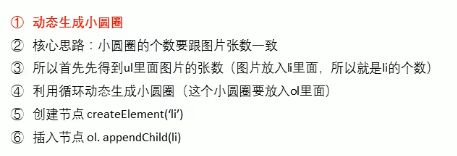
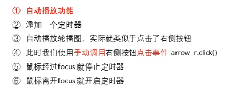
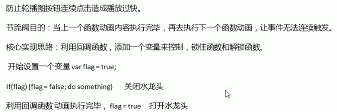

# 网页轮播图
[TOC]

###  分析
轮播图也称为焦点图，是网页中比较常见的网页特效。
```markdown
功能需求︰
1. 鼠标经过轮播图模块，左右按钮显示，离开隐藏左右按钮
2. 点击右侧按钮一次，图片往左播放一张，以此类推，左侧按钮同理。
3. 图片播放的同时，下面小圆圈模块跟随一起变化。
4. 点击小园圈，可以播放相应图片。
5. 鼠标不经过轮播图，轮播图也会自动播放图片。
6. 鼠标经过，轮播图模块，自动播放停止。

细节处理
1. 因为js较多，我们单独新建js文件夹，再新建js文件，引入页面中。
2. 此时需要添加load事件。
3. 鼠标经过轮播图模块，左右胺钮显示，离开隐藏左右按钮。
```
### 图片切换


```javascript
  <!-- 中间焦点图 -->
<div class="focus fl">
    <!-- 左侧按钮 -->
    <a href="javascript:;" class="arrow-l">
        &lt;
     </a>
    <!-- 右侧按钮 -->
    <a href="javascript:;" class="arrow-r"> &gt;</a>
    <ul>
        <li>
            <a href="#"></a>
        </li>
        <li>
            <a href="#"></a>
        </li>
        <li>
            <a href="#"></a>
        </li>
        <li>
            <a href="#"></a>
        </li>
    </ul>
         <!-- 小圆圈 -->
         <ol class="circle">
        </ol>
</div>
```
```javascript
window.addEventListener('load', function() {
    // 1. 获取元素
    var arrow_l = document.querySelector('.arrow-l');
    var arrow_r = document.querySelector('.arrow-r');
    var focus = document.querySelector('.focus');
    var focusWidth = focus.offsetWidth;
    // 2. 鼠标经过focus 就显示隐藏左右按钮
    focus.addEventListener('mouseenter', function() {
        arrow_l.style.display = 'block';
        arrow_r.style.display = 'block';
        clearInterval(timer);
        timer = null; // 清除定时器变量
    });
    focus.addEventListener('mouseleave', function() {
        arrow_l.style.display = 'none';
        arrow_r.style.display = 'none';
        timer = setInterval(function() {
            //手动调用点击事件
            arrow_r.click();
        }, 2000);
    });
}
```


```javascript
 
    // 3. 动态生成小圆圈  有几张图片，我就生成几个小圆圈
    var ul = focus.querySelector('ul');
    var ol = focus.querySelector('.circle');
    // console.log(ul.children.length);
    for (var i = 0; i < ul.children.length; i++) {
        // 创建一个小li 
        var li = document.createElement('li');
        // 记录当前小圆圈的索引号 通过自定义属性来做 
        li.setAttribute('index', i);
        // 把小li插入到ol 里面
        ol.appendChild(li);
```


```javascript
  // 4. 小圆圈的排他思想 我们可以直接在生成小圆圈的同时直接绑定点击事件
        li.addEventListener('click', function() {
            // 干掉所有人 把所有的小li 清除 current 类名
            for (var i = 0; i < ol.children.length; i++) {
                ol.children[i].className = '';
            }
            // 留下我自己  当前的小li 设置current 类名
            this.className = 'current';
```


```javascript
 // 5. 点击小圆圈，移动图片 当然移动的是 ul 
            // ul 的移动距离 小圆圈的索引号 乘以 图片的宽度 注意是负值
            // 当我们点击了某个小li 就拿到当前小li 的索引号
            var index = this.getAttribute('index');
            // 当我们点击了某个小li 就要把这个li 的索引号给 num  
            num = index;
            // 当我们点击了某个小li 就要把这个li 的索引号给 circle  
            circle = index;
            // num = circle = index;
            console.log(focusWidth);
            console.log(index);

            animate(ul, -index * focusWidth);
        })
    }
    // 把ol里面的第一个小li设置类名为 current
    ol.children[0].className = 'current';

```


```javascript
 // 7. 点击右侧按钮， 图片滚动一张
    var num = 0;
    // circle 控制小圆圈的播放
    var circle = 0;
    // flag 节流阀
    var flag = true;
    arrow_r.addEventListener('click', function() {
        if (flag) {
            flag = false; // 关闭节流阀
            // 如果走到了最后复制的一张图片，此时 我们的ul 要快速复原 left 改为 0
            if (num == ul.children.length - 1) {
                ul.style.left = 0;
                num = 0;
            }
            num++;
            animate(ul, -num * focusWidth, function() {
                flag = true; // 打开节流阀
            });
            // 8. 点击右侧按钮，小圆圈跟随一起变化 可以再声明一个变量控制小圆圈的播放
            circle++;
            // 如果circle == 4 说明走到最后我们克隆的这张图片了 我们就复原
            if (circle == ol.children.length) {
                circle = 0;
            }
            // 调用函数
            circleChange();
        }
    });

    // 9. 左侧按钮做法
    arrow_l.addEventListener('click', function() {
        if (flag) {
            flag = false;
            if (num == 0) {
                num = ul.children.length - 1;
                ul.style.left = -num * focusWidth + 'px';

            }
            num--;
            animate(ul, -num * focusWidth, function() {
                flag = true;
            });
            // 点击左侧按钮，小圆圈跟随一起变化 可以再声明一个变量控制小圆圈的播放
            circle--;
            circle = circle < 0 ? ol.children.length - 1 : circle;
            // 调用函数
            circleChange();
        }
    });

    function circleChange() {
        // 先清除其余小圆圈的current类名
        for (var i = 0; i < ol.children.length; i++) {
            ol.children[i].className = '';
        }
        // 留下当前的小圆圈的current类名
        ol.children[circle].className = 'current';
    }
```



```javascript
     var timer = setInterval(function() {
        //手动调用点击事件
        arrow_r.click();
    }, 2000);
```
### 节流阀


js完整代码
```javascript
window.addEventListener('load', function() {
    // 1. 获取元素
    var arrow_l = document.querySelector('.arrow-l');
    var arrow_r = document.querySelector('.arrow-r');
    var focus = document.querySelector('.focus');
    var focusWidth = focus.offsetWidth;
    // 2. 鼠标经过focus 就显示隐藏左右按钮
    focus.addEventListener('mouseenter', function() {
        arrow_l.style.display = 'block';
        arrow_r.style.display = 'block';
        clearInterval(timer);
        timer = null; // 清除定时器变量
    });
    focus.addEventListener('mouseleave', function() {
        arrow_l.style.display = 'none';
        arrow_r.style.display = 'none';
        timer = setInterval(function() {
            //手动调用点击事件
            arrow_r.click();
        }, 2000);
    });
    // 3. 动态生成小圆圈  有几张图片，我就生成几个小圆圈
    var ul = focus.querySelector('ul');
    var ol = focus.querySelector('.circle');
    // console.log(ul.children.length);
    for (var i = 0; i < ul.children.length; i++) {
        // 创建一个小li 
        var li = document.createElement('li');
        // 记录当前小圆圈的索引号 通过自定义属性来做 
        li.setAttribute('index', i);
        // 把小li插入到ol 里面
        ol.appendChild(li);
        // 4. 小圆圈的排他思想 我们可以直接在生成小圆圈的同时直接绑定点击事件
        li.addEventListener('click', function() {
            // 干掉所有人 把所有的小li 清除 current 类名
            for (var i = 0; i < ol.children.length; i++) {
                ol.children[i].className = '';
            }
            // 留下我自己  当前的小li 设置current 类名
            this.className = 'current';
            // 5. 点击小圆圈，移动图片 当然移动的是 ul 
            // ul 的移动距离 小圆圈的索引号 乘以 图片的宽度 注意是负值
            // 当我们点击了某个小li 就拿到当前小li 的索引号
            var index = this.getAttribute('index');
            // 当我们点击了某个小li 就要把这个li 的索引号给 num  
            num = index;
            // 当我们点击了某个小li 就要把这个li 的索引号给 circle  
            circle = index;
            // num = circle = index;
            console.log(focusWidth);
            console.log(index);

            animate(ul, -index * focusWidth);
        })
    }
    // 把ol里面的第一个小li设置类名为 current
    ol.children[0].className = 'current';
    // 6. 克隆第一张图片(li)放到ul 最后面
    var first = ul.children[0].cloneNode(true);
    ul.appendChild(first);
    // 7. 点击右侧按钮， 图片滚动一张
    var num = 0;
    // circle 控制小圆圈的播放
    var circle = 0;
    // flag 节流阀
    var flag = true;
    arrow_r.addEventListener('click', function() {
        if (flag) {
            flag = false; // 关闭节流阀
            // 如果走到了最后复制的一张图片，此时 我们的ul 要快速复原 left 改为 0
            if (num == ul.children.length - 1) {
                ul.style.left = 0;
                num = 0;
            }
            num++;
            animate(ul, -num * focusWidth, function() {
                flag = true; // 打开节流阀
            });
            // 8. 点击右侧按钮，小圆圈跟随一起变化 可以再声明一个变量控制小圆圈的播放
            circle++;
            // 如果circle == 4 说明走到最后我们克隆的这张图片了 我们就复原
            if (circle == ol.children.length) {
                circle = 0;
            }
            // 调用函数
            circleChange();
        }
    });

    // 9. 左侧按钮做法
    arrow_l.addEventListener('click', function() {
        if (flag) {
            flag = false;
            if (num == 0) {
                num = ul.children.length - 1;
                ul.style.left = -num * focusWidth + 'px';

            }
            num--;
            animate(ul, -num * focusWidth, function() {
                flag = true;
            });
            // 点击左侧按钮，小圆圈跟随一起变化 可以再声明一个变量控制小圆圈的播放
            circle--;
            // 如果circle < 0  说明第一张图片，则小圆圈要改为第4个小圆圈（3）
            // if (circle < 0) {
            //     circle = ol.children.length - 1;
            // }
            circle = circle < 0 ? ol.children.length - 1 : circle;
            // 调用函数
            circleChange();
        }
    });

    function circleChange() {
        // 先清除其余小圆圈的current类名
        for (var i = 0; i < ol.children.length; i++) {
            ol.children[i].className = '';
        }
        // 留下当前的小圆圈的current类名
        ol.children[circle].className = 'current';
    }
    // 10. 自动播放轮播图
    var timer = setInterval(function() {
        //手动调用点击事件
        arrow_r.click();
    }, 2000);

})
```
### animate函数
animate函数放到animate.js里，按需引入,并且需要写在要引入文件的上面
- 左右
```java 
function animate(obj, target, callback) {
    // console.log(callback);  callback = function() {}  调用的时候 callback()

    // 先清除以前的定时器，只保留当前的一个定时器执行
    clearInterval(obj.timer);
    obj.timer = setInterval(function() {
        // 步长值写到定时器的里面
        // 把我们步长值改为整数 不要出现小数的问题
        // var step = Math.ceil((target - obj.offsetLeft) / 10);
        var step = (target - obj.offsetLeft) / 10;
        step = step > 0 ? Math.ceil(step) : Math.floor(step);
        if (obj.offsetLeft == target) {
            // 停止动画 本质是停止定时器
            clearInterval(obj.timer);
            // 回调函数写到定时器结束里面
            // if (callback) {
            //     // 调用函数
            //     callback();
            // }
            callback && callback();
        }
        // 把每次加1 这个步长值改为一个慢慢变小的值  步长公式：(目标值 - 现在的位置) / 10
        obj.style.left = obj.offsetLeft + step + 'px';

    }, 15);
}
```
- 上下(窗口)
```javascript
  function animate(obj, target, callback) {
    // console.log(callback);  callback = function() {}  调用的时候 callback()
    // 先清除以前的定时器，只保留当前的一个定时器执行
    clearInterval(obj.timer);
    obj.timer = setInterval(function() {
        // 步长值写到定时器的里面
        // 把我们步长值改为整数 不要出现小数的问题
        // var step = Math.ceil((target - obj.offsetLeft) / 10);
        var step = (target - window.pageYOffset) / 10;
        step = step > 0 ? Math.ceil(step) : Math.floor(step);
        if (window.pageYOffset == target) {
            // 停止动画 本质是停止定时器
            clearInterval(obj.timer);
            // 回调函数写到定时器结束里面
            // if (callback) {
            //     // 调用函数
            //     callback();
            // }
            callback && callback();
        }
        // 把每次加1 这个步长值改为一个慢慢变小的值  步长公式：(目标值 - 现在的位置) / 10
        // obj.style.left = window.pageYOffset + step + 'px';
        window.scroll(0, window.ageYOffset + step);
    }, 15);
}
```
