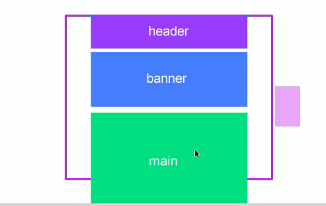
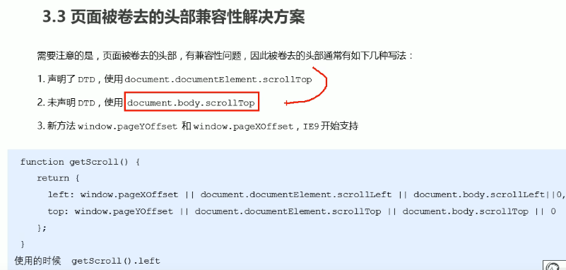
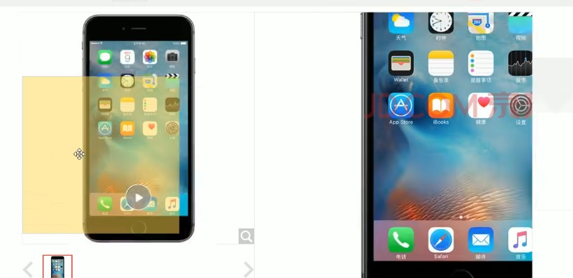

# 仿网站效果
@[TOC]
### 仿淘宝固定侧边栏


```markdown
案例分析
1.  原先侧边栏是绝对定位
2.  当页面滚动到一定位置，侧边栏改为固定定位
3.  页面继续滚动，会让返回顶部显示出来

细节处理
1. 需要用到页面滚动事件scroll因为是页面滚动，所以事件源是document
2. 滚动到某个位置，就是判断页面被卷去的上部值。
3. 页面被卷去的头部∶可通过window.pageYoffset获得; 如果是被卷去的左侧 window.pagexOffset
4. 注意，元素被卷去的头部是element.scrollTop ,如果是页面被卷去的头部则是window.pageYOffset
```

```javascript
<body>
    <div class="slider-bar">
        <span class="goBack">返回顶部</span>
    </div>
    <div class="header w">头部区域</div>
    <div class="banner w">banner区域</div>
    <div class="main w">主体部分</div>
    <script>
        //1. 获取元素
        var sliderbar = document.querySelector('.slider-bar');
        var banner = document.querySelector('.banner');
        // banner.offestTop 就是被卷去头部的大小 一定要写到滚动的外面
        var bannerTop = banner.offsetTop
        // 当我们侧边栏固定定位之后应该变化的数值
        var sliderbarTop = sliderbar.offsetTop - bannerTop;
        // 获取main 主体元素
        var main = document.querySelector('.main');
        var goBack = document.querySelector('.goBack');
        var mainTop = main.offsetTop;
        // 2. 页面滚动事件 scroll
        document.addEventListener('scroll', function () {
            // console.log(11);
            // window.pageYOffset 页面被卷去的头部
            // console.log(window.pageYOffset);
            // 3 .当我们页面被卷去的头部大于等于了 172 此时 侧边栏就要改为固定定位
            if (window.pageYOffset >= bannerTop) {
                sliderbar.style.position = 'fixed';
                sliderbar.style.top = sliderbarTop + 'px';
            } else {
                sliderbar.style.position = 'absolute';
                sliderbar.style.top = '500px';
            }
            // 4. 当我们页面滚动到main盒子，就显示 goback模块
            if (window.pageYOffset >= mainTop) {
                goBack.style.display = 'block';
            } else {
                goBack.style.display = 'none';
            }

        });
        goBack.addEventListener('click', function () {
            animate(window, 0);
        })

        function animate(obj, target, callback) {
            // console.log(callback);  callback = function() {}  调用的时候 callback()

            // 先清除以前的定时器，只保留当前的一个定时器执行
            clearInterval(obj.timer);
            obj.timer = setInterval(function () {
                // 步长值写到定时器的里面
                // 把我们步长值改为整数 不要出现小数的问题
                // var step = Math.ceil((target - obj.offsetLeft) / 10);
                var step = (target - window.pageYOffset) / 10;
                step = step > 0 ? Math.ceil(step) : Math.floor(step);
                if (window.pageYOffset == target) {
                    // 停止动画 本质是停止定时器
                    clearInterval(obj.timer);
                    // 回调函数写到定时器结束里面
                    // if (callback) {
                    //     // 调用函数
                    //     callback();
                    // }
                    callback && callback();
                }
                // 把每次加1 这个步长值改为一个慢慢变小的值  步长公式：(目标值 - 现在的位置) / 10
                // obj.style.Top = window.pageYOffset + step + 'px';
                window.scroll(0, window.pageYOffset + step)

            }, 15);
        }
    </script>
</body>
```
补充：



### 仿淘宝返回顶部

```markdown
细节处理
1. 滚动窗口至文档中的特定位置 window.scroll(x, y)
2. 使用动画返回顶部
3. 使用之前写的animate()函数
4. 页面滚动了多少，可以通过window.pageYoffset得到
5. 最后是页面滚动，使用window.scrollx,y)
```
```javascript
<body>
    <div class="slider-bar">
        <span class="goBack">返回顶部</span>
    </div>
    <div class="header w">头部区域</div>
    <div class="banner w">banner区域</div>
    <div class="main w">主体部分</div>
    <script>
        //1. 获取元素
        var sliderbar = document.querySelector('.slider-bar');
        var banner = document.querySelector('.banner');
        // banner.offestTop 就是被卷去头部的大小 一定要写到滚动的外面
        var bannerTop = banner.offsetTop
            // 当我们侧边栏固定定位之后应该变化的数值
        var sliderbarTop = sliderbar.offsetTop - bannerTop;
        // 获取main 主体元素
        var main = document.querySelector('.main');
        var goBack = document.querySelector('.goBack');
        var mainTop = main.offsetTop;
        // 2. 页面滚动事件 scroll
        document.addEventListener('scroll', function() {
                // console.log(11);
                // window.pageYOffset 页面被卷去的头部
                // console.log(window.pageYOffset);
                // 3 .当我们页面被卷去的头部大于等于了 172 此时 侧边栏就要改为固定定位
                if (window.pageYOffset >= bannerTop) {
                    sliderbar.style.position = 'fixed';
                    sliderbar.style.top = sliderbarTop + 'px';
                } else {
                    sliderbar.style.position = 'absolute';
                    sliderbar.style.top = '300px';
                }
                // 4. 当我们页面滚动到main盒子，就显示 goback模块
                if (window.pageYOffset >= mainTop) {
                    goBack.style.display = 'block';
                } else {
                    goBack.style.display = 'none';
                }

            })
            // 3. 当我们点击了返回顶部模块，就让窗口滚动的页面的最上方
        goBack.addEventListener('click', function() {
            // 里面的x和y 不跟单位的 直接写数字即可
            // window.scroll(0, 0);
            // 因为是窗口滚动 所以对象是window
            animate(window, 0);
        });
        // 动画函数
        function animate(obj, target, callback) {
            // console.log(callback);  callback = function() {}  调用的时候 callback()

            // 先清除以前的定时器，只保留当前的一个定时器执行
            clearInterval(obj.timer);
            obj.timer = setInterval(function() {
                // 步长值写到定时器的里面
                // 把我们步长值改为整数 不要出现小数的问题
                // var step = Math.ceil((target - obj.offsetLeft) / 10);
                var step = (target - window.pageYOffset) / 10;
                step = step > 0 ? Math.ceil(step) : Math.floor(step);
                if (window.pageYOffset == target) {
                    // 停止动画 本质是停止定时器
                    clearInterval(obj.timer);
                    // 回调函数写到定时器结束里面
                    // if (callback) {
                    //     // 调用函数
                    //     callback();
                    // }
                    callback && callback();
                }
                // 把每次加1 这个步长值改为一个慢慢变小的值  步长公式：(目标值 - 现在的位置) / 10
                // obj.style.left = window.pageYOffset + step + 'px';
                window.scroll(0, window.ageYOffset + step);
            }, 15);
        }
    </script>
</body>
```

### 仿京东放大镜



```markdown
案例分析
1. 整个案例可以分为三个功能模块
2. 鼠标经过小图片盒子，黄色的遮挡层和大图片盒子显示，离开隐藏2个盒子功能
3. 黄色的遮挡层跟随鼠标功能。
4. 移动黄色遮挡层,大图片跟随移动功能。
```
- html
```javascript
<div class="preview_img">
    <!-- 产品图 -->
    
    <!-- 选择块 -->
    <div class="mask"></div>
    <!-- 放大镜 -->
    <div class="big">
        
    </div>
</div>
```
- js
```javascript
.preview_img {
    position: relative;
    height: 398px;
    border: 1px solid #ccc;
}

.mask {
    display: none;
    position: absolute;
    top: 0;
    left: 0;
    width: 300px;
    height: 300px;
    background: #FEDE4F;
    opacity: .5;
    border: 1px solid #ccc;
    cursor: move;
}

.big {
    display: none;
    position: absolute;
    left: 410px;
    top: 0;
    width: 500px;
    height: 500px;
    background-color: pink;
    z-index: 999;
    border: 1px solid #ccc;
    overflow: hidden;
}

.big img {
    position: absolute;
    top: 0;
    left: 0;
}
```
- css
```javascript
window.addEventListener('load', function() {
    var preview_img = document.querySelector('.preview_img');
    var mask = document.querySelector('.mask');
    var big = document.querySelector('.big');
    // 1. 当我们鼠标经过 preview_img 就显示和隐藏 mask 遮挡层 和 big 大盒子
    preview_img.addEventListener('mouseover', function() {
        mask.style.display = 'block';
        big.style.display = 'block';
    })
    preview_img.addEventListener('mouseout', function() {
            mask.style.display = 'none';
            big.style.display = 'none';
        })
        // 2. 鼠标移动的时候，让黄色的盒子跟着鼠标来走
    preview_img.addEventListener('mousemove', function(e) {
        // (1). 先计算出鼠标在盒子内的坐标
        var x = e.pageX - this.offsetLeft;
        var y = e.pageY - this.offsetTop;
        // console.log(x, y);
        // (2) 减去盒子高度 300的一半 是 150 就是我们mask 的最终 left 和top值了
        // (3) 我们mask 移动的距离
        var maskX = x - mask.offsetWidth / 2;
        var maskY = y - mask.offsetHeight / 2;
        // (4) 如果x 坐标小于了0 就让他停在0 的位置
        // 遮挡层的最大移动距离
        var maskMax = preview_img.offsetWidth - mask.offsetWidth;
        if (maskX <= 0) {
            maskX = 0;
        } else if (maskX >= maskMax) {
            maskX = maskMax;
        }
        if (maskY <= 0) {
            maskY = 0;
        } else if (maskY >= maskMax) {
            maskY = maskMax;
        }
        mask.style.left = maskX + 'px';
        mask.style.top = maskY + 'px';
        // 3. 大图片的移动距离 = 遮挡层移动距离 * 大图片最大移动距离 / 遮挡层的最大移动距离
        // 大图
        var bigIMg = document.querySelector('.bigImg');
        // 大图片最大移动距离
        var bigMax = bigIMg.offsetWidth - big.offsetWidth;
        // 大图片的移动距离 X Y
        var bigX = maskX * bigMax / maskMax;
        var bigY = maskY * bigMax / maskMax;
        bigIMg.style.left = -bigX + 'px';
        bigIMg.style.top = -bigY + 'px';
    })
})
```


### 筋头云

```markdown
案例分析
鼠标经过某个小li，筋斗云跟这到当前小li位置
鼠标离开这个小li，筋斗云复原为原来的位置
鼠标点击了某个小li，筋斗云就会留在点击这个小li的位置

细节处理
1. 利用动画函数做动画效果
2. 原先筋斗云的起始位置是0
3. 鼠标经过某个小li，把当前小i的offsetLeft位置做为目标值即可
4. 鼠标离开某个小li，就把目标值设为0
```

```javascript
 window.addEventListener('load', function() {
            // 1. 获取元素
            var cloud = document.querySelector('.cloud');
            var c_nav = document.querySelector('.c-nav');
            var lis = c_nav.querySelectorAll('li');
            // 2. 给所有的小li绑定事件 
            // 这个current 做为筋斗云的起始位置
            var current = 0;
            for (var i = 0; i < lis.length; i++) {
                // (1) 鼠标经过把当前小li 的位置做为目标值
                lis[i].addEventListener('mouseenter', function() {
                    animate(cloud, this.offsetLeft);
                });
                // (2) 鼠标离开就回到起始的位置 
                lis[i].addEventListener('mouseleave', function() {
                    animate(cloud, current);
                });
                // (3) 当我们鼠标点击，就把当前位置做为目标值
                lis[i].addEventListener('click', function() {
                    current = this.offsetLeft;
                });
            }
        })
```

