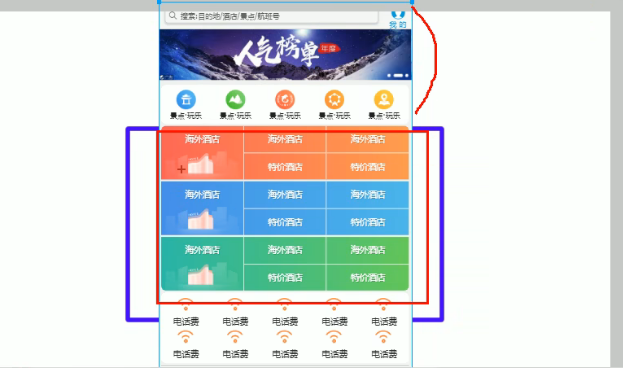

# 移动端网页特效
[toc]
### 1.触屏事件

#### 1.1触屏事件概述

  移动端浏览器兼容性较好，我们不需要考虑以前JS的兼容性问题，可以放心的使用原生JS书写效果，但是移动端也有自己独特的地方。比如触屏事件touch (也称触摸事件） ，Android和IOS都有。
touch对象代表一个触摸点。触摸点可能是一根手指，也可能是一根触摸笔。触屏事件可响应用户手指(或触控笔)对屏幕或者触控板操作。

常见的触屏事件如下:
| 触屏touch事件 | 说明                          |
| ------------- | ----------------------------- |
| touchstart    | 手指触摸到一个DOM元素时触发   |
| touchmove     | 手指在一个DOM元素上滑动时触发 |
| touchend      | 手指从一个DOM元素上移开时触发 |

#### 1.2触屏事件对象(TouchEvent)
TouchEvent是一类描述手指在触摸平面(触摸屏、触膜板等）的状态变化的事件。这类事件用于描述一个或多个触点，使开发者可以检测触点的移动，触点的增加和减少，等等
touchstart、touchmove、touchend三个事件都会各自有事件对象。

| 触摸列表       | 说明                                             |
| -------------- | ------------------------------------------------ |
| touches        | 正在触摸屏幕的所有手指的一个列表                 |
| targetTouches  | 正在触摸当前DOM元素上的手指的一个列表            |
| changedTouches | 手指状态发生了改变的列表，从无到有，从有到无变化 |
> 如果侦听的是一个DOM元素，touches和targetTouches是一样的

####  1.3移动端拖动元素
1. touchstart、touchmove、touchend可以实现拖动元素
2. 但是拖动元素需要当前手指的坐标值我们可以使用targetTouches[0]里面的pageX和pageY
3. 移动端拖动的原理:手指移动中，计算出手指移动的距离。然后用盒子原来的位置＋手指移动的距离
4. 手指移动的距离:手指滑动中的位置减去手指刚开始触摸的位置
>拖动元素三步曲:
>( 1 )触摸元素touchstart : 获取手指初始坐标，同时获得盒子原来的位置
> ( 2 )移动手指touchmove : 将计算手指的滑动距离，并且移动盒子
>( 3 )离开手指touchend : 
> 注意:手指移动也会触发滚动屏幕所以这里要阻止默认的屏幕滚动e.preventDefaultO;
```javascript
<head>
    <meta charset="UTF-8">
    <meta name="viewport" content="width=device-width, initial-scale=1.0">
    <meta http-equiv="X-UA-Compatible" content="ie=edge">
    <title>Document</title>
    <style>
        div {
            position: absolute;
            left: 0;
            width: 100px;
            height: 100px;
            background-color: pink;
        }
    </style>
</head>

<body>
    <div></div>
    <script>
        // （1） 触摸元素 touchstart：  获取手指初始坐标，同时获得盒子原来的位置
        // （2） 移动手指 touchmove：  计算手指的滑动距离，并且移动盒子
        // （3） 离开手指 touchend:
        var div = document.querySelector('div');
        var startX = 0; //获取手指初始坐标
        var startY = 0;
        var x = 0; //获得盒子原来的位置
        var y = 0;
        div.addEventListener('touchstart', function(e) {
            //  获取手指初始坐标
            startX = e.targetTouches[0].pageX;
            startY = e.targetTouches[0].pageY;
            x = this.offsetLeft;
            y = this.offsetTop;
        });

        div.addEventListener('touchmove', function(e) {
            //  计算手指的移动距离： 手指移动之后的坐标减去手指初始的坐标
            var moveX = e.targetTouches[0].pageX - startX;
            var moveY = e.targetTouches[0].pageY - startY;
            // 移动我们的盒子 盒子原来的位置 + 手指移动的距离
            this.style.left = x + moveX + 'px';
            this.style.top = y + moveY + 'px';
            e.preventDefault(); // 阻止屏幕滚动的默认行为
        });
    </script>
</body>
```

### 2.移动端轮播图
```markdown
案例分析
1. 可以自动播放图片
2. 手指可以拖动播放轮播图

自动播放功能
1. 开启定时器
2. 移动端移动，可以使用translate移动(不用加定位)
3. 想要图片优雅的移动，请添加过渡效果

-  无缝滚动
1. 注意，我们判断条件是要等到图片滚动完毕再去判断，就是过渡完成后判断
2. 此时需要添加检测过渡完成事件 transitionend
3. 判断条件︰如果索引号等于3说明走到最后一张图片，
4. 此时索引号要复原为0此时图片，去掉过效果，然后移动

-  小圆点跟随变化效果
1. 把ol里面li带有current类名的选出来去掉类名remove
2. 让当前索引号的小li加上 current add
3. 但是，是等着过渡结束之后变化，所以这个写到transitionend事件里面

-  手指滑动轮播图
1. 本质就是ul跟随手指移动，简单说就是移动端拖动元素
2. 触摸元素touchstart:获取手指初始坐标
3. 移动手指touchmove :计算手指的滑动距离，并且移动盒子
4. 离开手指touchend:根据滑动的距离分不同的情况
5. 如果移动距离大于某个像素就上一张下―张滑动。
```

```javascript
  //  获取元素 
    var focus = document.querySelector('.focus');
    var ul = focus.children[0];
    // 获得focus 的宽度
    var w = focus.offsetWidth;
    var ol = focus.children[1];
    // 1. 利用定时器自动轮播图图片
    var index = 0;
    var timer = setInterval(function() {
        index++;
        var translatex = -index * w;
        ul.style.transition = 'all .3s';
        ul.style.transform = 'translateX(' + translatex + 'px)';
    }, 2000);
    // 等着我们过渡完成之后，再去判断 监听过渡完成的事件 transitionend 
     
```
```javascript
 ul.addEventListener('transitionend', function() {
        // 2.无缝滚动
        if (index >= 3) {
            index = 0;
            // console.log(index);
            // 去掉过渡效果 这样让我们的ul 快速的跳到目标位置
            ul.style.transition = 'none';
            // 利用最新的索引号乘以宽度 去滚动图片
            var translatex = -index * w;
            ul.style.transform = 'translateX(' + translatex + 'px)';
        } else if (index < 0) {
            index = 2;
            ul.style.transition = 'none';
            // 利用最新的索引号乘以宽度 去滚动图片
            var translatex = -index * w;
            ul.style.transform = 'translateX(' + translatex + 'px)';
        }
        // 3. 小圆点跟随变化
        // 把ol里面li带有current类名的选出来去掉类名 remove
        ol.querySelector('.current').classList.remove('current');
        // 让当前索引号 的小li 加上 current   add
        ol.children[index].classList.add('current');
    });
```

```javascript
// 4. 手指滑动轮播图 
    // 触摸元素 touchstart： 获取手指初始坐标
    var startX = 0;
    var moveX = 0; // 后面我们会使用这个移动距离所以要定义一个全局变量
    var flag = false;
    ul.addEventListener('touchstart', function(e) {
        startX = e.targetTouches[0].pageX;
        // 手指触摸的时候就停止定时器
        clearInterval(timer);
    });
    // 移动手指 touchmove： 计算手指的滑动距离， 并且移动盒子
    ul.addEventListener('touchmove', function(e) {
        // 计算移动距离
        moveX = e.targetTouches[0].pageX - startX;
        // 移动盒子：  盒子原来的位置 + 手指移动的距离 
        var translatex = -index * w + moveX;
        // 手指拖动的时候，不需要动画效果所以要取消过渡效果
        ul.style.transition = 'none';
        ul.style.transform = 'translateX(' + translatex + 'px)';
        flag = true; // 如果用户手指移动过我们再去判断否则不做判断效果
        e.preventDefault(); // 阻止滚动屏幕的行为
    });
    // 手指离开 根据移动距离去判断是回弹还是播放上一张下一张
    ul.addEventListener('touchend', function(e) {
        if (flag) {
            // (1) 如果移动距离大于50像素我们就播放上一张或者下一张
            if (Math.abs(moveX) > 50) {
                // 如果是右滑就是 播放上一张 moveX 是正值
                if (moveX > 0) {
                    index--;
                } else {
                    // 如果是左滑就是 播放下一张 moveX 是负值
                    index++;
                }
                var translatex = -index * w;
                ul.style.transition = 'all .3s';
                ul.style.transform = 'translateX(' + translatex + 'px)';
            } else {
                // (2) 如果移动距离小于50像素我们就回弹
                var translatex = -index * w;
                ul.style.transition = 'all .1s';
                ul.style.transform = 'translateX(' + translatex + 'px)';
            }
        }
        // 手指离开的时候就重新开启定时器
        clearInterval(timer);
        timer = setInterval(function() {
            index++;
            var translatex = -index * w;
            ul.style.transition = 'all .3s';
            ul.style.transform = 'translateX(' + translatex + 'px)';
        }, 2000);
    });

```


#### classList属性
classList属性是HTML5新增的一个属性，返回元素的类名。但是ie10以上版本支持。
该属性用于在元素中添加，移除及切换CSS类。
| 功能   | 代码                              |
| ------ | --------------------------------- |
| 添加类 | element.classList.add (’类名’)    |
| 删除类 | element.classList.remove (’类名’) |
| 切换类 | element.classList.toggle (’类名’) |

```javascript
<div class="one two"></div>
<button> 开关灯</button>
<script>
    // classList 返回元素的类名
    var div = document.querySelector('div');
    // console.log(div.classList[1]);
    // 1. 添加类名  是在后面追加类名不会覆盖以前的类名 注意前面不需要加.
    div.classList.add('three');
    // 2. 删除类名
    div.classList.remove('one');
    // 3. 切换类
    var btn = document.querySelector('button');
    btn.addEventListener('click', function() {
        document.body.classList.toggle('bg');
    })
</script>
```

#### 返回顶部


```markdown
案例分析
1. 当页面滚动某个地方，就显示，否则隐藏点击可以返回顶部
2. 滚动某个地方显示
3. 事件: scroll页面滚动事件
4. 如果被卷去的头部(window.pageYOffset)大于某个数值
5. 点击，window.scroll(0,0)返回顶部
```

```javascript
// 返回顶部模块制作
    var goBack = document.querySelector('.goBack');
    var nav = document.querySelector('nav');
    window.addEventListener('scroll', function() {
        if (window.pageYOffset >= nav.offsetTop) {
            goBack.style.display = 'block';
        } else {
            goBack.style.display = 'none';
        }
    });
    goBack.addEventListener('click', function() {
        window.scroll(0, 0);
    })
```
#### click延时解决方案
移动端click事件会有300ms的延时，原因是移动端屏幕双击会缩放(double tap to zoom)页面。

解决方案:
1.禁用缩放。浏览器禁用默认的双击缩放行为并且去掉300ms的点击延迟。
```javascript
<meta name="viewport" content="user-scalable=no">
```
2.利用touch事件自己封装这个事件解决300ms延迟。
```markdown
原理就是∶
1. 当我们手指触摸屏幕，记录当前触摸时间
2. 当我们手指离开屏幕，用离开的时间减去触摸的时间
3. 如果时间小于150ms，并且没有滑动过屏幕，那么我们就定义为点击
```
```javascript
//封装tap，解决click 300ms延时
function tap (obj, callback){
    var isMove = false;
    var startTime = 0; 1//记录触摸时候的时间变量
    obj.addEventListener ( 'touchstart ' , function (e){
        startTime = Date.now() ; //记录触摸时间
    });
    obj.addEventListener ( 'touchmove', function (e){
        isMove = true; //看看是否有滑动,有滑动算拖拽，不算点击
    });
    obj.addEventListener ( 'touchend ' , function (e) {
    if (!isMove && (Date.now() - startTime)< 150){  //如果手指触摸和离开时间小于150ms 算点击
        callback && callback() ; //执行回调函数
        }
        isMove = false; //取反 重置
        startTime = 0;
    });
}
//调用
tap (div, function ( {  });  //执行代码
```
### 3.移动端常用开发插件

#### 3.1什么是插件
移动端要求的是快速开发，所以我们经常会借助于一些插件来帮我完成操作，那么什么是插件呢?
JS插件是js文件，它遵循一定规范编写，方便程序展示效果，拥有特定功能且方便调用。如轮播图和瀑布流插件。特点:它一般是为了解决某个问题而专门存在，其功能单一，并且比较小。
我们以前写的animate.,js也算一个最简单的插件
>fastclick插件解决300ms延迟。使用延时
GitHub官网地址: https://github.com/ftlabs/fastclick

#### 3.2 Swiper插件
>中文官网地址: https://www.swiper.com.cn/

1.引入插件相关文件。
2.按照规定语法使用
#### 3.3其他移动端常见插件
>superslide : http://www.superslide2.com/
iscroll : https://github.com/cubiq/iscroll

#### 3.4 插件的使用总结
1．确认插件实现的功能
2. 去官网查看使用说明
3．下载插件
4．打开demo实例文件，查看需要引入的相关文件，并且引入
5．复制demo实例文件中的结构html，样式css以及js代码

#### 3.5 移动端视频插件zy.media.js
H5给我们提供了video标签，但是浏览器的支持情况不同。不同的视频格式文件，我们可以通过source解决。
但是外观样式，还有暂停，播放，全屏等功能我们只能自己写代码解决。这时可以使用插件来制作。

### 4.移动端常用开发框架
####  4.1 框架概述
- 框架,  顾名思义就是一套架构，它会基于自身的特点向用户提供一套较为完整的解决方案。框架的控制权在框架本身，使用者要按照框架所规定的某种规范进行开发。
- 插件, 一般是为了解决某个问题而专门存在，其功能单一，并且比较小

 
>前端常用的框架有Bootstrap、Vue、Angular、React等。既能开发PC端，也能开发移动端前端常用的移动端插件有swiper、superslide、iscroll等。
框架:  大而全，一整套解决方案
插件:  小而专一，某个功能的解决方案

####  4.2 Bootstrap
Bootstrap是一个简洁、直观、强悍的前端开发框架，它让web开发更迅速、简单。它能开发PC端，也能开发移动端
```markdown
Bootstrap JS插件使用步骤︰
1. 引入相关js文件
2. 复制HTML结构
3. 修改对应样式
4. 修改相应JS参数
```
