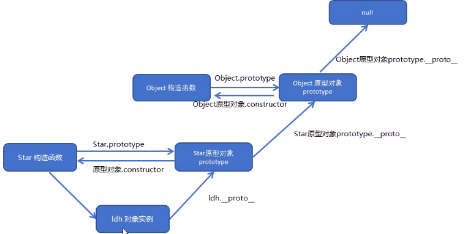

[toc]
# 一. 面向对象编程介绍 
>能够说出什么是面向对象
能够说出类和对象的关系
能够使用class创建自定义类
能够说出什么是继承

## 1.1 两大编程思想

### 1.面向过程编程POP
面向过程，就是按照我们分析好了的步骤，按照步骤解决问题。
对于编程，就是分析出解决问题所需要的步骤,然后用函数把这些步骤一步一步实现 ,使用的时候再一个一 个的依次调用就可以了。

>举个栗子:将大象装进冰箱
面向过程做法： 1.打开冰箱门  2.大象装进去  3.关上冰箱门

### 2.面向对象编程OOP
面向对象是把事务分解成为一个个对象,然后由对象之间分工与合作。是以对象功能来划分问题，而不是步骤。
在面向对象程序开发思想中,每一个对象都是功能中心,具有明确分工。
>举个栗子:将大象装进冰箱
面向对象做法： 1.大象对象 -进去      2.  冰箱对象  -打开  -关闭


面向对象编程具有灵活、代码可复用、容易维护和开发的优点,更适合多人合作的大型软件项目。
面向对象的特性:   封装性  继承性  多态性

### 3.面向过程和面向对象的对比
面向过程
>优点：性能比面向对象高，适合跟硬件联系很紧密的东西,
缺点：不易维护、不易复用、不易扩展。

面向对象
>优点：易维护、易复用、易扩展，由于面向对象有封装、继承、多态性的特性，可以设计出低耦合的系统，使系统 更加灵活、更加易于维护，
缺点：性能比面向过程低。

# 二. ES6中的类和对象
- 面向对象的思维特点:
    抽取(抽象)对象共用的属性和行为组织(封装)成一个类(模板)
    对类进行实例化,获取类的对象

- 面向对象编程：
我们考虑的是有哪些对象,按照面向对象的思维特点不断的创建对象、使用对象、指挥对象做事情。

## 2.1 对象
现实生活中, 万物皆对象,对象是一个具体的事物,看得见摸得着的实物。
在JavaScript中, 对象是一组无序的相关属性和方法的集合,所有的事物都是对象,例如字符串、数值、数组、函数等。

对象是由属性和方法组成的：
- 属性:事物的特征,在对象中用属性来表示(常用名词)
- 方法:事物的行为,在对象中用方法来表示(常用动词)
  
## 2.2 类 class
类, 抽象了对象的公共部分,它泛指某一大类( class)
对象, 特指某一个，通过类实例化一个具体的对象

## 2.3 创建类 
语法：
```javascript
class name {
          //class body
      }
```
创建实例：
```javascript
var xx = new name();
```

## 2.4 类 constructor 构造函数 
constructor() 方法是类的构造函数(默认方法)，用于传递参数,返回实例对象，
通过 new 命令生成对象实例时，自动调用该方法。
如果没有显示定义, 类内部会自动给我们创建一个constructor()。

```javascript
<script>
        //1.创建类 class 创建一个明星类
        class Star {
            constructor(uname,age){//类里面的构造函数
                this.uname = uname;
                this.age = age;
            }
        }
        //2.利用类创建对象new
        var ldh= new Star('刘德华',18);
        var zxy= new Star('张学友',20);
        console.log(ldh);
        console.log(zxy);
</script>
```
```javascript
1. 通过 class 关键字创建类，类名我们还是习惯性定义首字母大写
2. 类里面有个 constructor 函数，可以接收传递过来的参数，同时返回实例对象
3. constructor 函数只要 new 生成实例时，就会自动调用这个函数，如果我们不写这个函数，类也会自动生成这个函数
4. 生成实例 new 不能省略
5. 最后注意语法规范，创建类--类名后面不要加小括号，生成实例--类名后面加小括号，构造函数不需要加 function 关键字
```

## 2.5 类中添加方法 
语法规范：
```javascript
 //1.创建类 class 创建一个明星类
        class Star {
            //类的共有属性放到 constructor 里面
            constructor(uname,age){//类里面的构造函数
                this.uname = uname;
                this.age = age;
            }
            say(){
                console.log(this.uname + '你好');
            }
        }
```
示例：
```javascript
    <script>
        //1.创建类 class 创建一个明星类
        class Star {
            //类的共有属性放到 constructor 里面
            constructor(uname,age){//类里面的构造函数
                this.uname = uname;
                this.age = age;
            }
            say(){
                console.log(this.uname + '你好');
            }
            sing(song){
                console.log(this.uname + song);
            }
        }
        //2.利用类创建对象new
        var ldh= new Star('刘德华',18);
        var zxy= new Star('张学友',20);
        console.log(ldh);
        console.log(zxy);
 
        //我们类里面所有的函数不需要写function
        //多个函数方法之间不需要添加逗号分割
        ldh.say();
        zxy.say();
        ldh.sing('冰雨');
    </script>
```

# 三. 类的继承 

## 3.1 继承
现实中的继承：子承父业，比如我们都继承了父亲的姓。
程序中的继承：子类可以继承父类中的一些属性和方法。

语法：
```javascript
class Father{//父类
        }
class Son extends Father{//子类继承父类
        }
```
示例：
```javascript
class Father{//父类
        constructor(){
 
        }
        money(){
            console.log(100);
        }
}
class Son extends Father{//子类继承父类

        }
var son = new Son();
    son.money();
```

## 3.2 super关键字 
super 关键字用于访问和调用对象父类上的函数，可以调用父类的构造函数，也可以调用父类的普通函数。

### 1. super 关键字 调用父类的构造函数
```javascript
 class Father {
            constructor(x,y){
                this.x = x;
                this.y = y;
            }
            sum(){
                console.log(this.x + this.y);
            }
        }
class Son extends Father {
    constructor(x,y){
        super(x,y);//调用了父类中的构造函数
    }
}
var son = new Son(1,2);
var son1 = new Son(11,22);
son.sum();
son1.sum();
```

### 2. super 关键字 调用父类的普通函数 
语法：
```javascript
// 父类
class Person {
    constructor(surname){
        this.surname = surname;
    }
}
// 子类继承父类
class Student entends Person {
    constructor(surname,firstname) {
        super(surname);					//调用父类的 constructor(surname)
        this.firstname = firstname;		//定义子类独有的属性
    }
}
```
示例：
```javascript
//super关键字调用父类普通函数
    class Father {
        say(){
            return '我是爸爸';
        }
    }
    class Son extends Father {
        say(){
            // console.log('我是儿子');
            console.log(super.say()+'的儿子');
            // super.say()就是调用父类中的普通函数 say()
        }
    }
    var son = new Son();
    son.say();
```
### 3. super必须放到子类this之前
注意：子类在构造函数中使用super，必须放到this前面（必须先调用父类的构造方法，再使用子类构造方法）
```javascript
<script>
    //父类有加法方法
    class Father{
        constructor(x,y){
            this.x = x;
            this.y = y;
        }
        sum(){
            console.log(this.x + this.y);
        }
    }
    //子类继承父类加法方法  同时扩展减法方法
    class Son extends Father{
        constructor(x,y){
            //利用super调用父类的构造函数
            //super必须在子类this之前调用
            super(x,y);
            this.x = x;
            this.y = y;
        }
        subtract(){
            console.log(this.x - this.y);
        }
    }
    var son = new Son(5,2);
    son.sum();
    son.subtract();
    </script>
```

### 4. ES6中的类和对象使用时的三个注意点 
三个注意点：
```javascript
1. 在ES6中类没有变量提升，所以必须先定义类，才能通过类实例化对象
2. 类里面的共有属性和方法一定要加 this 使用
3. 类里面的 this 指向：
   constructor 里面的 this 指向实例对象，方法里面的 this 指向这个方法的调用者
```
```javascript
<body>
    <button>点击</button>
    <script>
    var that;
    class Star {
        constructor(uname,age){
            //constructor里面的this指向的是创建的实例对象
            that = this;
            this.uname = uname;
            this.age = age;
            // this.sing();
            this.btn = document.querySelector('button');
            this.btn.onclick = this.sing;//这个方法后面不用小括号，因为想点击完之后再调用
        }
        sing(){
            //这个sing方法里面的this指向的是btn这个按钮  因为钮调用了这个函数
            console.log(this);//button
            console.log(that.uname);//that里面存储的constructor里面的this
        }
        dance(){
            //这个dance里面的this指向的是实例对象 ldh  因为ld调用了这个函数
            console.log(this);
        }
    }
    var ldh = new Star('刘德华');
    console.log(that === ldh);
    ldh.dance();
    // ldh.sing();
    //1.在ES6中类没有变量提升，所以必须先定义类，才能通过类实例对象
    //2.类里面的共有属性和方法一定要加this使用
    </script>
</body>
```
##  面向对象案例


抽象对象: Tab对象   
功能：切换功能  添加功能   删除功能 修改功能

1. 切换功能
```javascript
var that;
class Tab{
    constructor(id){
        that = this;
        this.main = document.querySelector(id);
        this.lis = this.main.querySelectorAll('li');
        this.sections = this.main.querySelectorAll('section');
        this.init();
    }
    init(){
        for(var i=0;i<this.lis.length;i++){
            this.lis[i].index = i;
            this.lis[i].onclick = this.toggleTab;
        }
    }
    /* 切换 */
    toggleTab(){
        // console.log(this.index);
        that.clearClass();
        this.className = 'liactive';
        that.sections[this.index].className = "conactive";
       
    }
    clearClass(){
        for(var i=0;i<this.lis.length;i++){
            this.lis[i].className = '';
            this.sections[i].className = '';
        }
    }
    /* 添加 */
    addTab(){}
    /* 删除功能 */
    removeTab(){}
    /* 修改功能 */
    editTab(){}
}
var tab = new Tab("#tab");
tab.init();
```


insertAdjacentHTML(position, text)
position
> beforebegin  元素自身前面
> afterbegin 插入元素内部的第一个子节点之后
> beforeend  插入元素内部的最后一个子节点之后
> afterend  元素自身后面
text
> :html、xml
```javascript
var that;
class Tab {
    constructor(id) {
        // 获取元素
        that = this;
        this.main = document.querySelector(id);
        this.add = this.main.querySelector('.tabadd');
        // li的父元素
        this.ul = this.main.querySelector('.fisrstnav ul:first-child');
        // section 父元素
        this.fsection = this.main.querySelector('.tabscon');
        this.init();
    }
    init() {
            this.updateNode();
            // init 初始化操作让相关的元素绑定事件
            this.add.onclick = this.addTab;
            for (var i = 0; i < this.lis.length; i++) {
                this.lis[i].index = i;
                this.lis[i].onclick = this.toggleTab;
                this.remove[i].onclick = this.removeTab;
                this.spans[i].ondblclick = this.editTab;
                this.sections[i].ondblclick = this.editTab;

            }
        }
        // 因为我们动态添加元素 需要从新获取对应的元素
    updateNode() {
            this.lis = this.main.querySelectorAll('li');
            this.sections = this.main.querySelectorAll('section');
            this.remove = this.main.querySelectorAll('.icon-guanbi');
            this.spans = this.main.querySelectorAll('.fisrstnav li span:first-child');
        }
        // 1. 切换功能
    toggleTab() {
            // console.log(this.index);
            that.clearClass();
            this.className = 'liactive';
            that.sections[this.index].className = 'conactive';
        }
        // 清除所有li 和section 的类
    clearClass() {
            for (var i = 0; i < this.lis.length; i++) {
                this.lis[i].className = '';
                this.sections[i].className = '';
            }
        }
        // 2. 添加功能
    addTab() {
            that.clearClass();
            // (1) 创建li元素和section元素 
            var random = Math.random();
            var li = '<li class="liactive"><span>新选项卡</span><span class="iconfont icon-guanbi"></span></li>';
            var section = '<section class="conactive">测试 ' + random + '</section>';
            // (2) 把这两个元素追加到对应的父元素里面
            that.ul.insertAdjacentHTML('beforeend', li);
            that.fsection.insertAdjacentHTML('beforeend', section);
            that.init();
        }
        // 3. 删除功能
    removeTab(e) {
            e.stopPropagation(); // 阻止冒泡 防止触发li 的切换点击事件
            var index = this.parentNode.index;
            console.log(index);
            // 根据索引号删除对应的li 和section   remove()方法可以直接删除指定的元素
            that.lis[index].remove();
            that.sections[index].remove();
            that.init();
            // 当我们删除的不是选中状态的li 的时候,原来的选中状态li保持不变
            if (document.querySelector('.liactive')) return;
            // 当我们删除了选中状态的这个li 的时候, 让它的前一个li 处于选定状态
            index === 0? index++ : index--;
            // 手动调用我们的点击事件  不需要鼠标触发
            that.lis[index] && that.lis[index].click();
        }
        // 4. 修改功能
    editTab() {
        var str = this.innerHTML;
        // 双击禁止选定文字
        window.getSelection ? window.getSelection().removeAllRanges() : document.selection.empty();
        // alert(11);
        this.innerHTML = '<input type="text" />';
        var input = this.children[0];
        input.value = str;
        input.select(); // 文本框里面的文字处于选定状态
        // 当我们离开文本框就把文本框里面的值给span 
        input.onblur = function() {
            this.parentNode.innerHTML = this.value;
        };
        // 按下回车也可以把文本框里面的值给span
        input.onkeyup = function(e) {
            if (e.keyCode === 13) {
                // 手动调用表单失去焦点事件  不需要鼠标离开操作
                this.blur();
            }
        }
    }

}
new Tab('#tab');
```
# 四. 构造函数和原型
>能够使用构造函数创建对象
能够说出原型的作用
能够说出访问对象成员的规则
能够使用ES5新增的一些方法

## 4.1 构造函数和原型

### 1.概述 
在典型的OOP的语言中（如Java），都存在类的概念，类就是对象的模板，对象就是类的实例，但在ES6之前，JS中并没有引入类的概念。
在ES6之前，对象不是基于类创建的，而是用一种称为构造函数的特殊函数来定义对象和它们的特征。

创建对象可以通过以下三种方式：
```javascript
1. 对象字面量 {}
2. new Object()
3. 自定义构造函数 
```

### 2.构造函数 
构造函数是一种特殊的函数,主要用来初始化对象,即为对象成员变量赋初始值,它总与new一起使用。我们可以把对象中一些公共的属性和方法抽取出来 ，然后封装到这个函数里面。

- 在JS中,使用构造函数时要注意以下两点:
```javascript
1. 构造函数用于创建某一类对象,其首字母要大写
2. 构造函数要和new一起使用才有意义
```
- new在执行时会做四件事情:
```javascript
1. 在内存中创建一个新的空对象。
2. 让this指向这个新的对象。
3. 执行构造函数里面的代码，给这个新对象添加属性和方法
4. 返回这个新对象(所以构造函数里面不需要return)
```
```javascript
<script>
        //1.利用new Object()创建对象
        var obj1 = new Object();
        //2.利用对象字面量创建对象
        var obj2 = {};
        //3.利用构造函数创建对象
        function Star(uname,age){
            this.uname = uname;
            this.age = age;
            this.sing = function(){
                console.log('sing');
            }
        }
        var ldh = new Star('刘德华',20);
        console.log(ldh);
        ldh.sing();
</script>
```
- JavaScript的构造函数中可以添加一些成员,可以在构造函数本身上添加,也可以在构造函数内部的this上添加。通过这两种方式添加的成员,就分别称为静态成员和实例成员。
```javascript
静态成员: 在构造函数本身上添加的成员称为静态成员，只能由构造函数本身来访问
实例成员: 在构造函数内部创建的对象成员称为实例成员，只能由实例化的对象来访问
```
```javascript
<script>
        //构造函数中的属性和方法我们称为成员，成员可以添加
        function Star(uname,age){
            this.uname = uname;
            this.age = age;
            this.sing = function(){
                console.log('sing');
            }
        }
        var ldh = new Star('刘德华',18);
        //1.实例成员就是构造函数内部通过this添加的成员 uname age sing 就是实例成员
        //实例成员只能通过实例化的对象来访问
        console.log(ldh.uname);
        console.log(Star.uname);//不可以通过构造函数来访问实例成员

        //2.静态成员  在构造函数本身上添加的成员 sex就是静态成员
        Star.sex = '男';
        //静态成员只能通过构造函数来访问
        console.log(Star.sex);
        console.log(ldh.sex);//不能通过对象来访问
</script>
```
### 3.构造函数原型 prototype 
- 构造函数的问题:  存在浪费内存的问题，每个对象都有不同的位置的同一函数
  
构造函数通过原型分配的函数是所有对象所==共享的==。
JavaScript规定,==每一个构造函数都有一个prototype属性==,指向另一个对象。 注意这个prototype就是一个对象,这个对象的所有属性和方法,都会被构造函数所拥有。
==我们可以把那些不变的方法,直接定义在prototype对象上,这样所有对象的实例就可以共享这些方法==

>原型是一个对象 ，我们也称prototype为原型对象。
原型的作用是什么？ ==共享方法==

```javascript
/* 构造函数原型 prototype */
    function Star(uname,age){
        this.uname = uname;
        this.age = age;
        // this.sing = function(){
        //     console.log('sing');
        // }
    }
    Star.prototype.sing = function(){
        console.log("vvccccc");
    }
    var ldh = new Star('刘德华',20);
    var zxy = new Star('张学友',18);
    console.log(ldh.sing == zxy.sing)  //true
    console.dir(Star);
    ldh.sing();
    zxy.sing();
```
### 4.对象原型_proto_
==对象都会有一个属性_proto_== 指向构造函数的 prototype原型对象,之所以对象可以使用构造函数prototype原型对象的属性和方法,就是因为对象有_ proto_ 原型的存在。 

- _proto_对象原型和原型对象prototype是等价的
- \_proto\_ 对象原型的意义就在于为对象的查找机制提供一个方向 ，或者说一条路线,但是它是一个非标准属性,因此实际开发中，==不可以使用这个属性，它只是内部指向原型对象prototype==


>_proto_已经从web标准中删除，若要访问对象原型，建议使用Object.getPrototypeOf()  
或： 对象.\_\_proto\_\_

```javascript
        function Star(uname,age){
            this.uname = uname;
            this.age = age;
            // this.sing = function(){
            //     console.log('sing');
            // }
        }
        Star.prototype.sing = function(){
            console.log("vvccccc");
        }
        var ldh = new Star('刘德华',20);
        var zxy = new Star('张学友',18);
        console.log(ldh.sing == zxy.sing)  //true
        console.dir(Star);
        console.log(ldh)
        console.log(ldh.__proto__ === Star.prototype); //true

        console.log(ldh.__proto__);
        console.log(Object.getPrototypeOf(ldh));
```
### 5.constructor 构造函数
对象原型(\_\_proto\_\_ ) 和构造函数( prototype )原型对象里面都有一个属性constructor属性, constructor我们称为构造函数,因为它指回构造函数本身。

constructor 主要用于记录该对象引用于哪个构造函数，它可以让原型对象重新指向原来的构造函数。

```javascript
function Star(uname, age) {
    this.uname = uname;
    this.age = age;
}
// 很多情况下,我们需要手动的利用constructor 这个属性指回 来的构函数
// Star.prototype.sing = function() {
//     console.log('我会唱歌');
// };
// Star.prototype.movie = function() {
//     console.log('我会演电影');
// }
Star.prototype = {
    // 如果我们修改了原来的原型对象,给原型对象赋值的是一个象,则须手动的利用constructor指回原来的构造函数
    constructor: Star,
    sing: function() {
        console.log('我会唱歌');
    },
    movie: function() {
        console.log('我会演电影');
    }
}
var ldh = new Star('刘德华', 18);
var zxy = new Star('张学友', 19);
console.log(Star.prototype);
console.log(ldh.__proto__);
console.log(Star.prototype.constructor);
console.log(ldh.__proto__.constructor);
```
### 6.构造函数、实例、原型对象三者之间的关系


### 7.原型链
具体理解可以参考这个博客       https://www.jianshu.com/p/08c07a953fa0


### 8. JavaScript的成员查找机制（规则）
1. 当访问一一个对象的属性(包括方法)时,首先查找这个==对象自身==有没有该属性。
2. 如果没有就查找它的原型(也就是 \_\_proto\_\_ 指向的 prototype 原型对象)。
3. 如果还没有就查找原型对象的原型( Object的原型对象)。
4. 依此类推一直找到Object 为止( null )。
   
>这就是为什么我们定义的变量可以调用某些方法

### 9.原型对象的this指向问题

1. 在构造函数中，里面this指向的是对象实例
2. 原型对象函数里面的this 指向的是 实例对象
```javascript
 <script>
        function Star(uname, age) {
            this.uname = uname;
            this.age = age;
        }
        var that;
        Star.prototype.sing = function(){
            console.log('我会唱歌');
            that = this;
        }
        var ldh = new Star('刘德华',18);
        //1.在构造函数中，里面this指向的是对象实例 ldh
        ldh.sing();
        console.log(that === ldh);
        //2.原型对象函数里面的this 指向的是 实例对象 ldh
</script>
```

### 10. 扩展内置对象
可通过原型对象，对原来的内置对象进行扩展自定义的方法。比如给数组增加自定义求偶数和的功能。
```javascript
<script>
    //原型对象的应用  扩展内置对象方法
    console.log(Array.prototype);
    Array.prototype.sum = function () {
        var sum = 0;
        for (var i = 0; i < this.length; i++) {
            sum += this[i];
        }
        return sum;
    }
    var arr = [1, 2, 3];
    console.log(arr.sum());
    console.log(Array.prototype);
    var arr1 = new Array(11, 22, 33);
    console.log(arr1.sum());

//这种写法不可取，会把原来prototype里面的方法覆盖掉
//     Array.prototype = {
//         sum: function () {
//             var sum = 0;
//             for (var i = 0; i < this.length; i++) {
//                 sum += this[i];
//             }
//             return sum;
//         }
//     }
 </script>
```
>注意:注意∶数组和字符串内置对象不能给原型对象覆盖操作Array.prototype ={}，只能是Array.prototype.xx = function0的方式.

## 4.2 继承
ES6之前并没有给我们提供extends继承。我们可以通过构造函数+原型对象模拟实现继承,被称为组合继承。

### 1.call( )
调用这个函数，并修改函数运行时的this指向 
```javascript
 fun.call(thisArg , arg1 ,arg2 , ...)
```
- thisArg :当前调用函数this的指向对象
- arg1 , arg2 :传递的其他参数
  
call 方法的作用：
>1. 调用函数
>2. call()可以改变这个函数的this指向 
```javascript
 <script>
        // call方法
        function fn(){
            console.log('我想喝手磨咖啡');
            console.log(this); //window
            console.log(x + y);
        }
        var o = {
            name: 'andy'
        };
        // fn();
        //1.call()方法可以调用函数
        fn.call();
        //2.//call()可以改变这个函数的this指向  此时这个函数的this 就指向了o这个对象
        fn.call(o,1,2);
</script>
```
### 2.借用构造函数继承父类型属性 
核心原理：通过call()把父类型的this指向子类型的this，这样就可以实现子类型继承父类型的属性
```javascript
 <script>
        // 借用父构造函数继承属性
        // 1.父构造函数
        function Father(uname,age){
            // this指向父构造函数的对象实例
            this.uname = uname;
            this.age = age;
        }
        //2.子构造函数
        function Son(uname,age){
            // this 指向子构造函数的对象实例
            Father.call(this,uname,age);
            this.score = score;
        }
        var son = new Son('刘德华',18,100);
        console.log(son);
    </script>
```
### 3.利用原型对象继承父类型方法 

```javascript
 <script>
     // 借用父构造函数继承属性
    // 1.父构造函数
    function Father(uname,age){
        // this指向父构造函数的对象实例
        this.uname = uname;
        this.age = age;
    }
    Father.prototype.money = function(){
        console.log(10000);
    }
    //2.子构造函数
    function Son(uname,age,score){
        // this 指向子构造函数的对象实例
        Father.call(this,uname,age);
        this.score = score;
    } 
    // Son.prototype = Father.prototype; //这样直接赋值会有问题  如果修改了子原型对象，父原型象会跟着一起变化
    son.prototype = new Father();
    //如果利用对象的形式修改了原型对象，别忘了利用constructor 指回原来的构造函数
    Son.prototype.constructor = Son;
    //这个是子构造函数专门的方法
    Son.prototype.exam = function(){
        console.log('孩子要考试');
    }
    var son = new Son('刘德华',18,100);
    console.log(son);
    console.log(Father.prototype);
    console.log(Son.prototype.constructor);
</script>
```
### 构造函数特点
ES6 之前通过 构造函数 + 原型实现面向对象 编程
>(1) 构造函数有原型对象prototype 
(2) 构造函数原型对象prototype 里面有constructor 指向构造函数本身
(3) 构造函数可以通过原型对象添加方法
(4) 构造函数创建的实例对象有__proto__ 原型指向 构造函数的原型对象

### 类的特点
ES6 通过 类 实现面向对象编程 
 1. 类的本质其实还是一个函数 我们也可以简单的认为 类就是 构造函数的另外一种写法
>(1) 类有原型对象prototype 
    console.log(Star.prototype);
(2) 类原型对象prototype 里面有constructor 指向类本身
    console.log(Star.prototype.constructor);
(3)类可以通过原型对象添加方法
(4) 类创建的实例对象有__proto__ 原型指向 类的原型对象

## 4.3 ES5中新增方法

### 1. ES5新增方法概述
ES5中给我们新增了一些方法，可以很方便的操作数组或者字符串，这些方法主要包括：
- 数组方法
- 字符串方法
- 对象方法
  
### 2.数组方法 
迭代（遍历）方法：forEach()、map() 、filter()、some()、every();

#### forEach()
迭代（遍历）数组
```javascript
array.forEach(function(currentValue,index,arr))
```
- currentValue :数组当前项的值
- index :数组当前项的索引
- arr :数组对象本身

```javascript
<script>
        //forEach迭代（遍历）数组
        var arr = [1,2,3];
        var sum = 0;
        arr.forEach(function(value,index,array){
            console.log('每个数组元素'+value);
            console.log('每个数组元素的索引号'+index);
            console.log('数组本身'+array);
            sum += value;
        })
        console.log(sum);
    </script>
-------------------------------------
每个数组元素1
每个数组元素的索引号0数组本身1,2,3
每个数组元素2
每个数组元素的索引号1数组本身1,2,3
每个数组元素3
每个数组元素的索引号2数组本身1,2,3
6
-------------------------------------
```

#### filter() 
- filter(方法创建一个新的数组,新数组中的元素是通过检查指定数组中符合条件的所有元素，==主要用于筛选数组==
- 注意它直接==返回一个新数组==
```javascript
array.filter(function(currentValue,index,arr))
```

- currentValue:数组当前项的值
- ndex :数组当前项的索引
- arr :数组对象本身
  
```javascript
 <script>
        //filter筛选数组
       var arr = [12,66,4,88];
       var newarr = arr.filter(function(value,index){
            return value >= 20;
        });
        console.log(newarr);
    </script>
-------------------------------------
[66,  88]
-------------------------------------
```

#### some()
- some()方法用于检测数组中的元素是否满足指定条件.通俗点查找数组中是否有满足条件的元素
- 注意它返回值是布尔值如果查找到这个元素,就返回true,如果查找不到就返回false.
- 如果找到第一个满足条件的元素则终止循环不在继续查找
```javascript
array.some(function(currentValue,index,arr))
```
- currentValue:数组当前项的值
- index :数组当前项的索引
- arr :数组对象本身
```javascript
 <script>
        //some 查找数组中是否有满足条件的元素
        var arr = [10,30,4];
        var flag =  arr.some(function(value,){
            return value >= 20;
        });
        console.log(flag);
        var arr1 = ['red','pink','blue'];
        var flag1 = arr1.some(function(value){
            return value == 'pink';
        });
        console.log(flag1);
        //1.filter 也是查找满足条件的元素 返回的是一个数组 而且是把所有满足条件的元素返回回来
        //2.some 也是查找满足条件的元素是否存在  返回的是一个布尔值 如果查找到第一个满足条件的元素就终止循环
    </script>
```

#### ⭐查询商品案例--根据价格筛选商品
利用filter()方法和some()方法


```javascript
    <script>
        //利用新增数组方法操作数据
        var data = [{
            id:1,
            pname:'小米',
            price:3999
        },{
            id:2,
            pname:'oppo',
            price:999
        },{
            id:3,
            pname:'荣耀',
            price:1299
        },{
            id:4,
            pname:'华为',
            price:1999
        }];
        //1.获取相应的元素
        var tbody = document.querySelector('tbody');
        var search_price = document.querySelector('.search-price');
        var start = document.querySelector('.start');
        var end = document.querySelector('.end');
        var product = document.querySelector('.product');
        var search_prro = document.querySelector('.search-prro');
        //2.把数据渲染到页面中
        setDate(data);
        function setDate(mydata){
            //先清空原来tbody里面的数据
            tbody.innerHTML = '';
            mydata.forEach(function(value){
            // console.log(value);
            var tr = document.createElement('tr');
            tr.innerHTML = '<td>'+ value.id+'</td><td>'+ value.pname +'</td><td>'+ value.price +'</td>';
            tbody.appendChild(tr);
        })
        }
      
        //3.根据价格查询商品
        //当我们点击了按钮，就可以根据我们的商品价格去筛选数组里面的对象
        search_price.addEventListener('click',function(){
           var newData = data.filter(function(value){
                return value.price >= start.value && value.price <= end.value;
            })
            console.log(newData);
            setDate(newData);
        })
 
        //4.根据商品名称查询商品
        search_pro.addEventListener("click", function(){
            var name = product.value;
            if(name.length <=0) return alert('不能为空');
            /* 使用some */
            var arr= [];
            data.some(function(value){
                if(value.pname == name){
                    arr.push(value);
                    return true;
                }
            })     
            setData(arr);
            /* 使用 filter */
            // var filterdata = data.filter(function(value){
            //     return value.pname === name; 
            // })
            // setData(filterdata);
        })
    </script>
```

#### forEach方法和some方法的区别
forEach方法：在foreach里面 return 不会终止迭代，所以会输出两次11

```javascript
    var arr = ['red','blue','green','black'];
    //1.forEach迭代遍历
    arr.forEach(function(value){
        if(value == 'green'){
            console.log('找到了该元素');
            return true;  //在foreach里面 return 不会终止迭代
        }
        console.log(11);
    })
```
some方法：在some 里面 遇到 return  true 就会终止遍历， 迭代效率更高，所以只会输出一次11
如果想在数组中查找一个唯一的元素且查找完之后不再迭代，那么some是最好的选择。
 
```javascript
    var arr = ['red', 'blue', 'green', 'black'];
        //some迭代遍历
    arr.some(function(value){
    if(value == 'green'){
        console.log('找到了该元素');
        return true;  //在some 里面 遇到 return  true 就会终止遍历  迭代效率更高
    }
    console.log(11);
})
```
>return里面一定要写return true，代表找到了元素，可以终止迭代了
filter 和 return true一样，遇到return true不会终止迭代

### 3.字符串方法 

#### trim()方法
trim()方法会从一个字符串的两端删除空白字符
trim()方法并不影响原字符串本身，它返回的是一个新的字符串 

```javascript
    <input type="text"> <button>点击</button>
    <div></div>
    <script>
        //trim方法去除字符串两端空格,不会去掉字符串中间的空格
        var str = '   andy   ';
        console.log(str);
        var str1 = str.trim();
        console.log(str1);
        var input = document.querySelector('input');
        var btn = document.querySelector('button');
        var div = document.querySelector('div');
        btn.onclick = function(){
            var str = input.value.trim();
            if( str === ''){
                alert('请输入内容');
            }else {
                console.log(str);
                console.log(str.length);
                div.innerHTML = str;
            }
        }
    </script>
```

### 4.对象方法 

#### Object.keys()

Object.keys()用于获取对象自身的所有属性
- 效果类似for...in
- 返回一个由属性名组成的数组  
```javascript 
    //用于获取对象自身所有的属性
    var obj = {
        id : 1,
        pname:'小米',
        price:1999,
        num:2000
    };
    var arr = Object.keys(obj);
    console.log(arr);// ["id", "pname","", ""]
    arr.forEach(function(value){
       console.log(value);
    })
```

#### Object.defineProperty() 
Object.defineProperty()定义对象中新属性或修改原有的属性
```javascript 
Object.defineProperty(obj, prop, description)
```
- obj:必需，目标对象
- prop：必需，需定义或修改的属性的名字
- description:必需，目标属性所拥有的特性
- 第三个参数description说明：以对象形式{}书写
    value:设置属性的值，默认为undefined
    writtable：值是否可以重写，true|false  默认为false
    enumerable：目标属性是否可以被枚举，true|false  默认为false
    configurable：目标属性是否可以被删除或是否可以再次修改特性，true|false  默认为false

```javascript
 <script>
        //Object.defineProperty()定义新属性或修改原有的样式
        var obj = {
            id:1,
            pname:'小米',
            price:1999
        };
//1.以前的对象添加和修改属性的方式
        // obj.num = 1000;//向数组中添加属性
        // obj.price = 2000;//修改数组中原有的属性
        // console.log(obj);
 //2.Object.defineProperty()定义新属性或者修改原有的属性
        Object.defineProperty(obj,'num',{
            value:1000
        })
        Object.defineProperty(obj,'price',{
            value:9.9
        })
        console.log(obj);
        Object.defineProperty(obj,'id',{
            //如果值为false，则不允许修改这个属性值，默认值也是false
            writable:false
        });
        Object.defineProperty(obj,'adress',{
           value:'中国山东',
           writable:false,
           enumerable:false,//不允许遍历（枚举）  默认的值是 false
           configurable:false//不允许删除 不允许在修改第三个参数里面的特性 默认为false
        });
        console.log(obj);
        console.log(Object.keys(obj));
    </script>
```
[toc]
# 五.函数进阶
>能够说出函数的多种定义和调用方式
能够说出和改变函数内部this的指向
能够说出严格模式的特点
能够把函数作为参数和返回值传递
能够说出闭包的作用
能够说出递归的两个条件
能够说出深拷贝和浅拷贝的区别
## 5.1 函数的定义和调用

### 1.函数的定义方式
1. 函数声明方式function关键字（命名函数）
2. 函数表达式（匿名函数）
3. new Function()    特点：写起来较麻烦，且执行效率低
```javascript
var fn = new Function（'参数1'，'参数2'，'函数体'）
```
- Function里面的参数都必须是字符串格式 
- 所有的函数都是Function函数的实例(对象)
- 函数也属于对象

```javascript
<script>
        //1.自定义函数（命名函数）
        function fn(){};
 
        //2.函数表达式（匿名函数）
        var fun = function(){};
 
        //3.利用new Function（'参数1'，'参数2'，'函数体'）
        var f = new Function('a','b','console.log(a+b)');
        f(1,2);
 
        //4.所有函数都是 Function 的实例（对象）
        console.dir(f);
        //5.函数也属于对象
        console.log(f instanceof Object);
    </script>
```
### 2.函数的调用方式 
```javascript
1. 普通函数
2. 对象的方法
3. 构造函数
4. 绑定事件函数
5. 定时器函数
6. 立即执行函数
```
```javascript
<script>
        //函数的调用方式
 
        //1.普通函数
        function fn(){
            console.log('清河海风');
        }
        // fn();  fn.call();
 
        //2.对象的方法
        var o = {
            sayHi:function(){
                console.log('你好呀');
            }
        }
        o.sayHi();
 
        //3.构造函数
        function Star(){};
        new Star();
 
        //4.绑定事件函数
        btn.onclick = function(){};//点击了按钮就可以调用这个函数
 
        //5.定时器函数
        setInterval(function(){},1000); //这个函数是定时器自动一秒钟调用一次
 
        //6.立即执行函数  ----  立即执行函数是自动调用
        (function(){
            console.log('开始调用啦');
        })()
 
    </script>
```
## 5.2 this
这些this的指向，是当我们调用函数的时候确定的。调用方式的不同决定了this的指向不同
==一般指向我们的调用者。==
### 1.函数内的this指向

```javascript
<body>
    <button></button>
    <script>
        //函数的不同调用方式决定了this的指向不同
 
        //1.普通函数   this指向window
        function fn(){
            console.log('清河海风');
        }
        fn();
        // fn();  fn.call();
 
        //2.对象的方法   this指向的是对象
        var o = {
            sayHi:function(){
                console.log('你好呀');
            }
        }
        o.sayHi();
 
        //3.构造函数  this指向的是ldh这个实例对象  原型对象里面的this 指向的也是ldh这个实例对象
       function Star(){};
       var ldh = new.Star();
       Star.prototype.sing = function(){};
 
        //4.绑定事件函数  this指向的是函数的调用者   btn这个按钮对象
        var btn = document.querySelector('button');
        btn.onclick = function(){
            console.log('绑定时间函数的this:' + this);
        };//点击了按钮就可以调用这个函数
 
        //5.定时器函数  this指向的是window
        setInterval(function(){},1000); //这个函数是定时器自动一秒钟调用一次
 
        //6.立即执行函数  指向的是window
        //立即执行函数是自动调用
        (function(){
            console.log('开始调用啦');
        })()
 
    </script>
</body>
```
### 2.改变函数内部的this指向
JavaScript为我们专门提供了一些函数方法来帮我们更优雅的处理函数内部this的指向问题，常用的有bind()、call()、apply()三种方法
#### call()方法
call()方法调用一个对象，简单理解为调用函数的方式，但是它可以改变函数的this指向
```javascript
 fun.call(thisArg , arg1 ,arg2 , ...) 

  <script>
        //改变函数内this指向  js提供了三种方法  call() apply() bind()
 
        //1.call()
        var o = {
            name:'andy'
        }
        function fn(a,b){
            console.log(this);
            console.log(a + b);
        }
        fn.call(o,1,2);
        //call第一个可以调用函数  第二个可以改变函数内的this指向
        //call的主要作用可以实现继承
        function Father(uname,age,sex){
            this.uname = uname;
            this.age = age;
            this.sex = sex;
        }
        function Son(uname,age,sex){
            Father.call(this,uname,age,sex);
        }
        var Son = new Son('刘德华',20,'男')
        console.log(Son);
    </script>
```
#### apply方法 
apply()方法调用一个函数，简单理解为调用函数的方式，但是它可以改变函数的this指向
```javascript
fun.apply(thisArg,[argsArray])
```
- thisArg:在fun函数运行时指定的this值
- argsArray：传递的值，必须包含在数组里面
- 返回值是函数的返回值，因为它就是调用函数
```javascript
 <script>
        //2.apply()
        var o = {
            name:'andy'
        };
 
        function fn(arr){
            console.log(this);
            console.log(arr);
        };
        fn.apply(o,['pink']);
 
        //1.也是调用函数  第二个可以改变函数内部的this指向
        //2.但是他的参数必须是数组（伪数组）
        //3.apply的主要应用 比如我们可以利用apply借助于数学内置对象求最大值
        // Math.max();
        var arr = [1,66,3,99,4];
        var max =  Math.max.apply(null,arr);
        //Math.max(...arr);
        console.log(max);
    </script>
``` 
#### bind方法 
bind()方法不会调用函数，但是能改变函数内部的this指向
```javascript
fun.bind(thisArg,arg1,arg2,...)
```
- thisArg:在fun函数运行时指定的this值
- arg1，arg2：传递的其他参数
- 返回由指定的this值和初始化参数改造的==原函数拷贝==
```javascript
<body>
    <button></button>
    <button></button>
    <button></button>
   <script>
        var o = {
        name:'andy'
    };
    function fn (a,b){
        console.log(this);
        console.log(a + b);
    }
    var f = fn.bind(o,1,2);
    f();
    //1.不会调用原来的函数  可以改变原来函数内部的this指向
    //2.返回的是原函数改变this指回产生的新函数
    //3.如果有的函数不需要我们立即调用，但是又想改变这个函数内部的this指向，此时用bind

    //4.我们有一个按钮，当我们点击了之后，就禁用这个按钮，3秒钟之后开启这个按钮
    // var btn = document.querySelector('button');
    // btn.onclick = function(){
    //     this.disabled = true;//这个this指向的是btn这个按钮
    //     var that = this;
    //     setTimeout(function(){
    //         // that.disabled = false;//定时器函数里面的this指向的是window
    //         this.disabled = false;//此时定时器函数里面的this指向的是btn
    //     }.bind(this),3000); //这个this指向的是btn这个对象
    // }
    var btns = document.querySelectorAll('button');
    for(var i = 0; i < btns.length;i++){
        btns[i].onclick = function(){
            this.disabled = true;
            setTimeout(function(){
                this.disabled = false;
            }.bind(this),2000);
        }
    }
   </script>
</body>
```
### 3.call apply bind总结 
相同点：
>都可以改变函数内部的this指向

区别点：
>1. call和apply会调用函数，并且改变函数内部的this指向
>2. call和apply传递的参数不一样，
>   call传递参数aru1，aru2...形式  
>   apply必须数组形式[arg]
>3. bind不会调用函数，可以改变函数内部this指向
   
主要应用场景： 
>1.  call经常做继承
>2.  apply经常跟数组有关系，比如借助于数学对象实现数组最大值最小值
>3.  bind不调用函数，但是还想改变this指向，比如改变定时器内部的this指向

#### 面向对象案例完善 
<details>
<summary>展开查看</summary>
<pre><code>
class Tab {
    constructor(id) {
        // 获取元素
        // that = this;
        this.main = document.querySelector(id);
        this.add = this.main.querySelector('.tabadd');
        // li的父元素
        this.ul = this.main.querySelector('.fisrstnav ul:first-child');
        // section 父元素
        this.fsection = this.main.querySelector('.tabscon');
        this.init();
    }
    init() {
            this.updateNode();
            // init 初始化操作让相关的元素绑定事件
            this.add.onclick = this.addTab.bind(this.add, this);
            for (var i = 0; i < this.lis.length; i++) {
                this.lis[i].index = i;
                this.lis[i].onclick = this.toggleTab.bind(this.lis[i], this);
                this.remove[i].onclick = this.removeTab.bind(this.remove[i], this);
                this.spans[i].ondblclick = this.editTab;
                this.sections[i].ondblclick = this.editTab;
            }
        }
        // 因为我们动态添加元素 需要从新获取对应的元素
    updateNode() {
            this.lis = this.main.querySelectorAll('li');
            this.sections = this.main.querySelectorAll('section');
            this.remove = this.main.querySelectorAll('.icon-guanbi');
            this.spans = this.main.querySelectorAll('.fisrstnav li span:first-child');
        }
        // 1. 切换功能
    toggleTab(that) {
            // console.log(this.index);
            that.clearClass();
            this.className = 'liactive';
            that.sections[this.index].className = 'conactive';
        }
        // 清除所有li 和section 的类
    clearClass() {
            for (var i = 0; i < this.lis.length; i++) {
                this.lis[i].className = '';
                this.sections[i].className = '';
            }
        }
        // 2. 添加功能
    addTab(that) {
            that.clearClass();
            // (1) 创建li元素和section元素 
            var random = Math.random();
            var li = '<li class="liactive"><span>新选项卡</span><span class="iconfont icon-guanbi"></span></li>';
            var section = '<section class="conactive">测试 ' + random + '</section>';
            // (2) 把这两个元素追加到对应的父元素里面
            that.ul.insertAdjacentHTML('beforeend', li);
            that.fsection.insertAdjacentHTML('beforeend', section);
            that.init();
        }
        // 3. 删除功能
    removeTab(that, e) {
            e.stopPropagation(); // 阻止冒泡 防止触发li 的切换点击事件
            var index = this.parentNode.index;
            console.log(index);
            // 根据索引号删除对应的li 和section   remove()方法可以直接删除指定的元素
            that.lis[index].remove();
            that.sections[index].remove();
            that.init();
            // 当我们删除的不是选中状态的li 的时候,原来的选中状态li保持不变
            if (document.querySelector('.liactive')) return;
            // 当我们删除了选中状态的这个li 的时候, 让它的前一个li 处于选定状态
            index--;
            // 手动调用我们的点击事件  不需要鼠标触发
            that.lis[index] && that.lis[index].click();
        }
        // 4. 修改功能
    editTab() {
        var str = this.innerHTML;
        // 双击禁止选定文字
        window.getSelection ? window.getSelection().removeAllRanges() : document.selection.empty();
        // alert(11);
        this.innerHTML = '<input type="text" />';
        var input = this.children[0];
        input.value = str;
        input.select(); // 文本框里面的文字处于选定状态
        // 当我们离开文本框就把文本框里面的值给span 
        input.onblur = function() {
            this.parentNode.innerHTML = this.value;
        };
        // 按下回车也可以把文本框里面的值给span
        input.onkeyup = function(e) {
            if (e.keyCode === 13) {
                // 手动调用表单失去焦点事件  不需要鼠标离开操作
                this.blur();
            }
        }
    }
}
new Tab('#tab');
</code></pre>
</details> 

## 5.3 严格模式

### 1.什么是严格模式
JavaScript除了提供正常模式外，还提供了严格模式(strict mode)。ES5的严格模式是采用具有限制性JavaScript变体的一种方式，即在严格的条件下运行JS代码。

严格模式在IE10以上版本的浏览器中才会被支持。旧版本浏览器中会被忽略。

严格模式对正常的JavaScript语义做了一些更改 :
>1. 消除了Javascript语法的一些不合理、不严谨之处,减少了一些怪异行为。
>2. 消除代码运行的一些不安全之处,保证代码运行的安全。
>3. 提高编译器效率,增加运行速度。
>4. 禁用了在ECMAScript的未来版本中可能会定义的一些语法,为未来新版本的Javascript做好铺垫。比如一些保留字如: class, enum, export, extends, import, super不能做变量名

### 2.开启严格模式 
严格模式可以应用到整个脚本或个别函数中。因此在使用时，我们可以将严格模式分为为脚本开启严格模式和为函数开启严格模式两种情况。
#### a.为脚本开启严格模式
为整个脚本文件开启严格模式,需要在所有语句之前放一个特定语句"usestrict" ;( 或'usestrict' ;) 。
```javascript
 <script>
        'use strict';
        //  下面的js 代码会按照严格模式执行代码
    </script>
    <script>
        (function(){
            'use strict';
        })();
</script>
```
#### b.为函数开启严格模式
```javascript
 <script>
        function fn(){
            //此时只是给fn函数开启严格模式
            'use strict';
            //下面的代码按照严格模式执行
        }
        function fun(){
            //里面的还是按照普通模式执行
        }
 </script>
```
### 3.严格模式中的变化 
严格模式对JavaScript的语法和行为，都做了一些改变。
#### 1.变量规定
在正常模式中，如果一个变量没有声明就赋值，默认是全局变量。严格模式禁止这种用法，变量都必须先用var命令声明，然后再使用。
#### 2.严格模式下的this指向问题
>- 以前在全局作用域函数中的this指向window对象。
>- 😉严格模式下全局作用域中函数中的this是undefined.
>- 以前构造函数时不加new也可以调用，当普通函数，this指向全局对象
>- 严格模式下，如果构造函数不加new调用，this会报错
>- new实例化的构造函数指向创建的对象实例
>- 定时器this还是指向window
>- 事件，对象还是指向调用者。
更多严格模式要求参考: https://developer.mozilla.org/zh-CN/docs/Web/JavaScript/Reference/Strict mode
#### 3.函数变化
1. 函数不能有重名的参数
2. 函数必须声明在顶层新版本的JavaScript会引入“块级作用域”（ES6中已引入）。为了与新版本接轨，不允许在非函数的代码块内声明函数。
```javascript
   <script>
        'use strict';
        //1.我们的变量名必须先声明再使用
        // num = 10;
        // console.log(num);//会报错
 
        var num = 10;
        console.log(num);
 
        //2.我们不能随意删除已经声明好的变量
        delete num; //会报错
 
        //3.严格模式下全局作用域中函数中的this是undefined
 
        function fn(){
            console.log(this);
        }
        //4.严格模式下，如果构造函数不加new调用，this会报错
        function Star(){
            this.sex = '男';
        }
        Star();
       var ldh = new Star();
       console.log(ldh.sex);
       //5.定时器里面的this指向的是window
       setTimeout(function(){
           console.log(this);
       },2000)
    //6.严格模式下不允许有函数重名
    function fn(a,b){
        console.log(a+b);
    };
    fn(1,2);
    //7.
    </script>
```

## 5.4 高阶函数 
高阶函数是对其他函数进行操作的函数，它接收函数作为参数或将函数作为返回值输出。


此时fn就是一个高阶函数 
函数也是一种数据类型，同样可以作为参数，传递给另一个参数使用，最典型的就是作为回调函数
## 5.5 闭包

### 1.变量作用域
变量根据作用域的不同分为两种:全局变量和局部变量。
1. 函数内部可以使用全局变量。
2. 函数外部不可以使用局部变量。
3. 当函数执行完毕，本作用域内的局部变量会销毁

### 2.闭包
闭包(closure)指有权访问另一个函数作用域中变量的函数。

简单理解就是，一个作用域可以访问另一个函数内部的局部变量。
```javascript
<script>
        //闭包(closure)指有权访问另一个函数作用域中变量的函数
        //闭包：fun 这个函数作用域  访问了另一个函数fn 里面的局部变量 num
        //我们fn外面的作用域可以访问fn内部的局部变量
        //闭包的主要作用：延伸了变量的作用范围
        function fn(){
            var num = 10;
            function fun(){
                console.log(num);
            }
            return fun;
        }
        var f = fn();
        f();
        //类似于
        // var f = function fun(){
        //     console.log(num);
        // }
</script>
```
### 3.闭包案例 

#### ⭐循环注册点击事件（点击li输出当前li的索引号）
```javascript
    <ul class="nav">
        <li>榴莲</li>
        <li>臭豆腐</li>
        <li>鱼罐头</li>
        <li>大猪蹄子</li>
    </ul>
    <script>
        //闭包应用-点击li输出当前li的索引号
        //1.我们可以利用动态添加属性的方法做
        var lis = document.querySelector('.nav').querySelectorAll('li');
        for(var i = 0;i <lis.length; i++){
            lis[i].index = i;
            lis[i].onclick = function(){
                // console.log(i);
                console.log(this.index);
            }
        }
        //2.利用闭包的方式得到当前li 的索引号
        for(var i = 0; i < lis.length; i++){
            //利用for循环创建了4个立即执行函数
            //立即执行函数也成为小闭包，因为立即执行函数里面的任何一个函数都可以使用它的i这个变量
            (function(i){
                // console.log(i);
                lis[i].onclick = function(){
                    console.log(i);
                }
            })(i);
        }
    </script>
```

#### ⭐循环中的setTimeout() ---3秒之后，打印li元素的所有内容
```javascript
    <ul class="nav">
        <li>榴莲</li>
        <li>臭豆腐</li>
        <li>鱼罐头</li>
        <li>大猪蹄子</li>
    </ul>
    <script>
        //闭包应用=3秒钟之后，打印所有li元素的内容
        var lis = document.querySelector('.nav').querySelectorAll('li');
        for (var i = 0; i <lis.length; i++){
            (function(i){
                setTimeout(function(){
                console.log(lis[i].innerHTML);
            },3000)
            })(i);
        }
        </script>
```

#### ⭐闭包应用-计算打车价格 
```javascript
<script>
        //闭包应用-计算打车价格
        //打车起步价13（3公里内），之后每多一公里增加5块钱，用户输入公里数就可以计算打车价格
        //如果有拥堵情况，总价格多收取10块钱的拥堵费
 
       var car =  (function(){
            var start = 13; //起步价  局部变量
            var total = 0;  //总价    局部变量
            return {
                //正常的总价
                price:function(n){
                    if (n <= 3){
                        total = start;
                    } else {
                        total = start + (n - 3) * 5
                    }
                    return total;
                },
                //拥堵之后的费用
                yd:function(flag){
                   return flag ? total + 10 :total;
                } 
            }
        })();
 
        console.log(car.price(5));//23
        console.log(car.yd(true));//33
</script>
```
#### ⭐思考
```javascript
   // 思考题 1： 没有闭包
        var name = "The Window";
        var object = {
            name: "My Object",
            getNameFunc: function() {
                return function() {
                    return this.name;
                };
            }
        };

        console.log(object.getNameFunc()())
        var f = object.getNameFunc();
        // 类似于
        var f = function() {
            return this.name;
        }
        f();

        // 思考题 2： 有闭包
        var name = "The Window";　　
        var object = {　　　　
            name: "My Object",
            getNameFunc: function() {
                var that = this; // object
                return function() {
                    return that.name;
                };
            }
        };
        console.log(object.getNameFunc()())
```
### 4.闭包总结
闭包是什么：闭包是一个函数（一个作用域可以访问另外一个函数的局部变量）

闭包的作用是什么：延伸变量的作用范围

## 5.6 递归 

### 1.什么是递归
如果一个函数在内部可以调用其本身，那么这个函数就是递归函数
>简单理解：函数内部自己调用自己，这个函数就是递归i函数
递归函数的作用和循环效果一样 

由于递归很容易发生“栈溢出”错误（stack overflow），所以必须要加退出条件return
```javascript
 <script>
        //递归函数：函数内部自己调用自己，这个函数就是递归函数
        var num = 1;
        function fn(){
            console.log('我要打印六句话');
            if (num == 6){
                return;//递归里面必须加退出条件
            }
            num++;
            fn();
        }
        fn();
</script>
```
#### ⭐利用递归函数求1~n的阶乘
```javascript
  <script>
        //利用递归函数求1-n的阶乘  1*2*3*4*...n
        function fn(n){
            if (n === 1){
                return 1;
            }
            return n * fn(n-1);
        }
      console.log(fn(3));
 
      //详细思路  假设用户输入的是3
      // return 3 * fn(2)
      // return 3 * (2 * fn(2-1))
      // return 3 * (2 * fn(1))
      // return 3 * (2 * 1)
    //   return 3 * 2
    //   return 6
</script>
```
#### ⭐利用递归函数求斐波那契数列 （兔子序列）
```javascript
  <script>
        //利用递归函数求斐波那契数列（兔子序列）1，1，2，3，5，8，13，21...
        //用户输入一个数字n就可以求出 这个数字对应的兔子序列值
        //我们只需要知道用户输入n 的前面两项 （n-1 n-2）就可以计算出n对应的序列值
        function fb(n){
            if(n == 1 || n == 2){
                return 1;
            }
            return fb(n-1) + fb(n-2);
        }
       console.log(fb(4));
    </script>
```
#### ⭐利用递归求：根据id返回对应的数据对象 
```javascript
 <script>
        var data = [{
            id:1,
            name:'家电',
            goods:[{
                id:11,
                gname:'冰箱'
            },{
                id:12,
                gname:'洗衣机'
            }]
        },{
            id:2,
            name:'服饰'
        }];
        //我们想要做输入id号，就可以返回的数据对象
        //1.利用forEach遍历里面的每一个对象
        function getID(json,id){
            var o = {};
            json.forEach(function(item){
                // console.log(item); //2个数据元素
                if(item.id == id){
                    // console.log(item);
                    o = item;
                    //2.我们想要得到里层的数据 11-12可以利用递归函数
                    //里面应该有goods这个数组，并且这个数组的长度不为0
                } else if (item.goods && item.goods.length >0){
                  o = getID(item.goods,id);
                }
            });
            return o;
        }
        console.log(getID(data,1));
        console.log(getID(data,2));
        console.log(getID(data,11));
        console.log(getID(data,12));
    </script>
```
### 2.深拷贝和浅拷贝 
>https://blog.csdn.net/weixin_41910848/article/details/82144671?ops_request_misc=%257B%2522request%255Fid%2522%253A%2522164482007616781683923101%2522%252C%2522scm%2522%253A%252220140713.130102334..%2522%257D&request_id=164482007616781683923101&biz_id=0&utm_medium=distribute.pc_search_result.none-task-blog-2\~all\~top_positive~default-1-82144671.pc_search_insert_es_download&utm_term=%E6%B7%B1%E6%8B%B7%E8%B4%9D%E5%92%8C%E6%B5%85%E6%8B%B7%E8%B4%9D%E7%9A%84%E5%8C%BA%E5%88%AB&spm=1018.2226.3001.4187

> 1. 浅拷贝只是拷贝一层，更深层次对象级别的只拷贝引用（地址）
> 2. 深拷贝拷贝多层，每一级别的数据都会拷贝
> 3. Object.assign(target,...sources)     es6新增方法可以浅拷贝
> 
   
- 浅拷贝：假设B复制了A，如果复制之后修改B，A的数据也发生了变化，那么就是浅拷贝
    因为浅拷贝拷贝的是地址，当地址内数据发生变化时，那么指向地址的对象读取的数据发生了变化。 
```javascript
语法糖： Object.assign(target,...sources);

 <script>
        //浅拷贝只是拷贝一层，更深层次对象级别的只拷贝引用
        //深拷贝拷贝多层，每一级别的数据都会拷贝
        var obj = {
            id:1,
            name:'andy',
            msg:{
                age:18
            }
        };
        var o = {};
        // for (var k in obj){
        //     // k是属性名  obj[k]是属性值
        //     o[k] = obj[k];
        // }
        // console.log(o);
        // o.msg.age = 20;
        // console.log(obj);
 
        console.log('---------');
 
        Object.assign(o,obj);
        console.log(o);
        o.msg.age = 20;
        console.log(obj);
</script>
```

- 深拷贝：把旧内存空间里面的数据重新复制一份（开辟了一块新的内存空间），给了新的对象，所以当新的对象里面的值发生改变时，旧的对象不会发生改变。
```javascript
 <script>
        //深拷贝拷贝多层，每一级别的数据都会拷贝
        var obj ={
            id:1,
            name:'andy',
            msg:{
                age:18
            }
        };
        var o = {};
        //封装函数
        function deepCopy (newobj,oldobj){
            for(var k in oldobj){
                //判断我们的属性属于哪种数据类型
                //1.获取属性值 oldobj[k]
                var item = oldobj[k];
                //2.判断这个值是否是数组  必须先判断数组，因为数组也是对象，先判断对象的话会把数组筛选出去
                if(item instanceof Array){
                    newobj[k] = [];
                    deepCopy(newobj[k],item)
                } else if (item instanceof Object){
                     //3.判断这个值是否是对象
                     newobj[k]= {};
                     deepCopy(newobj[k],item)
                } else {
                      //4.属于简单数据类型
                      newobj[k] = item;
                }
            }
        }
        deepCopy(o,obj);
        console.log(o);
        o.msg.age = 20;
        console.log(obj);
</script>
```


