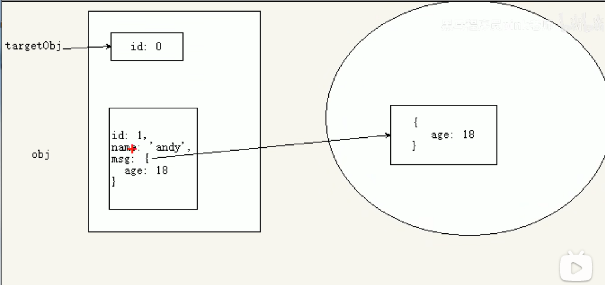
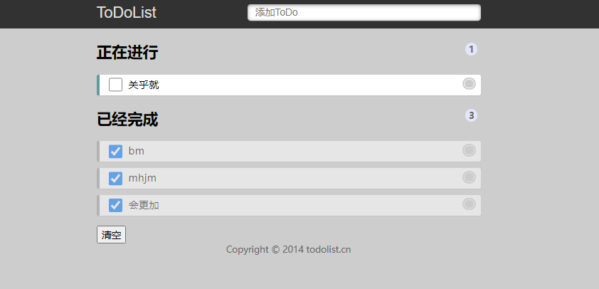

# jQueryAPI
>能够写出常用的jQuery选择器
能够操作jQuery样式
能够写出常用的jQuery动画
能够操作jQuery属性
能够操作jQuery元素
能够操作jQuery元素尺寸、位置
[toc]
## 1. 选择器
### 1.1 jQuery 基础选择器
原生JS获取元素方式很多，很杂，而且兼容性情况不一致，因此jQuery给我们做了封装，使获取元素统一标准。
```javascript
$("选择器")//里面选择器直接写CSS选择器即可，但是要加引号
```
|  名称   |  用法   |  描述  |
| --- | --- |--- |
|  ID选择器   |  $(""#id"")   |   获取指定ID的元素 |
|  全选选择器   |  $(*')   |  匹配所有元素  | 
| 类选择器  |  $(".class"")   | 获取同一类class的元素  
|   标签选择器  | $("div")    |  获取同一类标签的所有元素  |
|   并集选择器  | $s("div,p,li")    |  选取多个元素  |
|  交集选择器   |  $("li.current")   |  交集元素  |
### 1.2 jQuery 层级选择器
|  名称   |  用法   |  描述  |
| --- | --- |--- |
| 子代选择器| $("ul>li");|使用>号，获取亲儿子层级的元素;注意，并不会获取孙子层级的元素 |
| 后代选择器| $("ul li");|使用空格，代表后代选择器，获取ul下的所有li元素，包括孙子等 |
### 1.3 隐式迭代（重要)
- 遍历内部 DOM元素(伪数组形式存储）的过程就叫做隐式迭代。
- 简单理解∶给匹配到的所有元素进行循环遍历，执行相应的方法，而不用我们再进行循环，简化我们的操作，方便我们调用。
```javascript
    <div>惊喜不意外不</div>
    <div>惊喜不意外不</div>
    <div>惊喜不意外不</div>
    <div>惊喜不意外不</div>
    <ul>
        <li>相同的操作</li>
        <li>相同的操作</li>
        <li>相同的操作</li>
    </ul>
    <script>
        // 1. 获取四个div元素 
        console.log($("div"));
        // 2. 给四个div设置背景颜色为粉色 jquery对象不能使用style
        $("div").css("background", "pink");
        // 3. 隐式迭代就是把匹配的所有元素内部进行遍历循环，给每一个元素添加css这个方法
        $("ul li").css("color", "red");
```
### 1.4 jQuery 筛选选择器

| 语法 | 用法 | 描述  |
| --- | --- | --- |
| :first | $("li:first') | 获取第一个li元素 |
| :last | $("li:last') | 获取最后一个li元素 |
| :eq(index) | $("li:eq(2)") | 获取到的li元素中，选择索引号为2的元素，索引号index从0开始 |
| :odd | $s("li:odd") |  获取到的li元素中，选择索引号为奇数的元素|
| :even | $("Ili:even") |  获取到的li元素中，选择索引号为偶数的元素|

### 1.5 jQuery 筛选方法（重要)

 <div class="table-box">
        <table>
            <thead>
                <tr>
                    <th>语法</th>
                    <th>用法</th>
                    <th>说明</th>
                </tr>
            </thead>
            <tbody>
                <tr>
                    <td style="color:red">parent()</td>
                    <td>$('li').parent();</td>
                    <td>查找父级(最近一级的父元素)</td>
                </tr>
                <tr>
                    <td style="color:red">children(selector)</td>
                    <td>$('ul').children('li');</td>
                    <td>相当于$('ul&gt;li'),最近一级(亲儿子)</td>
                </tr>
                <tr>
                    <td style="color:red">find(selector)</td>
                    <td>$('ul').find('li');</td>
                    <td>相当于$('ul li')，后代选择器</td>
                </tr>
                <tr>
                    <td style="color:red">siblings(selector)</td>
                    <td>$('.first').siblings('li')</td>
                    <td>查找兄弟节点，不包括自己本身</td>
                </tr>
                <tr>
                    <td>nextAll([expr])</td>
                    <td>$('.first').nextAll()</td>
                    <td>查找当前元素之后所有的同辈元素</td>
                </tr>
                <tr>
                    <td>prevtAll([expr])</td>
                    <td>$('.last').prevAll()</td>
                    <td>查找当前 元素之前所有的同辈元素</td>
                </tr>
                <tr>
                    <td>hasClass(class)</td>
                    <td>$('div').hasClass('protected')</td>
                    <td>检查当前的元素是否含有某个特定的类，如果有，则返回true</td>
                </tr>
                <tr>
                    <td>eq(index)</td>
                    <td>$('li').eq(2)</td>
                    <td>相当于$('li:eq(2)'),index从开始</td>
                </tr>
            </tbody>
        </table>
    </div>
还有 .parents

#### 案例： 新浪下拉菜单

<details>
<summary>展开查看</summary>
<pre>
<code>
    <head>
        <meta charset="UTF-8">
        <meta name="viewport" content="width=device-width, initial-scale=1.0">
        <meta http-equiv="X-UA-Compatible" content="ie=edge">
        <title>Document</title>
        <script src="jquery.min.js"></script>
        <style>
            * {
                margin: 0;
                padding: 0;
            }
            li {
                list-style-type: none;
            }
            a {
                text-decoration: none;
                font-size: 14px;
            }
            .nav {
                margin: 100px;
            }
            .nav>li {
                position: relative;
                float: left;
                width: 80px;
                height: 41px;
                text-align: center;
            }
            .nav li a {
                display: block;
                width: 100%;
                height: 100%;
                line-height: 41px;
                color: #333;
            }
            .nav>li>a:hover {
                background-color: #eee;
            }
            .nav ul {
                display: none;
                position: absolute;
                top: 41px;
                left: 0;
                width: 100%;
                border-left: 1px solid #FECC5B;
                border-right: 1px solid #FECC5B;
            }
            .nav ul li {
                border-bottom: 1px solid #FECC5B;
            }
            .nav ul li a:hover {
                background-color: #FFF5DA;
            }
        </style>
    </head>
    <body>
        <ul class="nav">
            <li>
                <a href="#">微博</a>
                <ul>
                    <li>
                        <a href="">私信</a>
                    </li>
                    <li>
                        <a href="">评论</a>
                    </li>
                    <li>
                        <a href="">@我</a>
                    </li>
                </ul>
            </li>
            <li>
                <a href="#">微博</a>
                <ul>
                    <li>
                        <a href="">私信</a>
                    </li>
                    <li>
                        <a href="">评论</a>
                    </li>
                    <li>
                        <a href="">@我</a>
                    </li>
                </ul>
            </li>
            <li>
                <a href="#">微博</a>
                <ul>
                    <li>
                        <a href="">私信</a>
                    </li>
                    <li>
                        <a href="">评论</a>
                    </li>
                    <li>
                        <a href="">@我</a>
                    </li>
                </ul>
            </li>
            <li>
                <a href="#">微博</a>
                <ul>
                    <li>
                        <a href="">私信</a>
                    </li>
                    <li>
                        <a href="">评论</a>
                    </li>
                    <li>
                        <a href="">@我</a>
                    </li>
                </ul>
            </li>
        </ul>
        <script>
            $(function() {// 鼠标经过
                $(".nav>li").mouseover(function() {
                    // $(this) jQuery 当前元素  this不要加引号
                    // show() 显示元素  hide() 隐藏元素
                    $(this).children("ul").show();
                });
                // 鼠标离开
                $(".nav>li").mouseout(function() {
                    $(this).children("ul").hide();
                })
            })
        </script>
    <body>
</code>
</pre>
</details>

### 1.6 排他思想

想要多选一的效果，排他思想:   当前元素设置样式，其余的兄弟元素清除样式。

```javascript
<button>快速</button>
<button>快速</button>
<button>快速</button>
<button>快速</button>
<script>
    $(function() {
        // 1. 隐式迭代 给所有的按钮都绑定了点击事件
        $("button").click(function() {
            // 2. 当前的元素变化背景颜色
            $(this).css("background", "pink");
            // 3. 其余的兄弟去掉背景颜色 隐式迭代
            $(this).siblings("button").css("background", "");
        });
    })
</script>
```

### 1.7 链式编程

链式编程是为了节省代码量，看起来更优雅。

```javascript
$(this).css('color" , "red').siblings.css("color", "")
```

```javascript
    woshi body 的文字
    <button>快速</button>
    <button>快速</button>
    <button>快速</button>
    <button>快速</button>
    <button>快速</button>
    <button>快速</button>
    <button>快速</button>
    <script>
        $(function() {
            // 1. 隐式迭代 给所有的按钮都绑定了点击事件
            $("button").click(function() {
                // 2. 让当前元素颜色变为红色
                // $(this).css("color", "red");
                // 3. 让其余的姐妹元素不变色 
                // $(this).siblings().css("color", "");
                // 链式编程
                // $(this).css("color", "red").siblings().css("color", "");
                // 我的颜色为红色, 我的兄弟的颜色为空
                // $(this).siblings().css('color', 'red');
                // 我的兄弟变为红色  ,我本身不变颜色
                $(this).siblings().parent().css('color', 'blue');
                // 最后是给我的兄弟的爸爸 body 变化颜色 

            });
        })
    <script>
```

####  案例： 淘宝服饰切换

```markdown
案例分析
1. 核心原理∶鼠标经过左侧盒子某个小li，就让内容区盒子相对应图片显示，其余的图片隐藏
2. 需要得到当前小li的索引号，就可以显示对应索引号的图片
3. jQuery得到当前元素索引号$(this).index()
4. 中间对应的图片，可以通过eq(index)方法去选择
5. 显示元素show)隐藏元素hide()
```

```javascript
 $(function() {
            // 1. 鼠标经过左侧的小li 
            $("#left li").mouseover(function() {
                // 2. 得到当前小li 的索引号
                var index = $(this).index();
                console.log(index);
                // 3. 让我们右侧的盒子相应索引号的图片显示出来就好了
                 $("#content div").eq(index).show();
                // 4. 让其余的图片（就是其他的兄弟）隐藏起来
                 $("#content div").eq(index).siblings().hide();
                // 链式编程
                $("#content div").eq(index).show().siblings().hide();

            })
        })
```

## 2. 样式操作
### 2.1 操作css方法
jQuery可以使用css方法来修改简单元素样式;也可以操作类，修改多个样式.
(1)  参数只写属性名，则是返回属性值，字符串形式
```javascript
$(this).css("color");
```
(2)  参数是属性名，属性值，逗号分隔，是设置一组样式，属性必须加引号，值如果是数字可以不用跟单位和引号
```javascript
$(this).css("color" , ""red");
```
(3)  参数可以是对象形式，方便设置多组样式。属性名和属性值用冒号隔开，属性可以不用加号
```javascript
$(this).css({ "color":" white" ," font-size":" 20px"});
```
### 2.2 设置类样式方法
作用等同于以前的classList,可以操作类样式，注意操作类里面的参数==不要加点==

|  操作   |   代码  |
| --- | --- |
| 添加类    | $('div').addClass('current'); |
| 移除类  | $('div').removeClass('current'); |
| 切换类  | $('div').toggleClass('current'); |

#### 案例： tab栏切换分析
```markdown
案例分析
1. 点击上部的li，当前li添加current类，其余兄弟移除类
2. 点击的同时，得到当前li的索引号
3. 让下部里面相应索引号的item显示，其余的item隐藏
```
<details>
<summary>展开查看</summary>
<pre><code>
<textarea>
 <div class="tab">
    <div class="tab_list">
        <ul>
            <li class="current">商品介绍</li>
            <li>规格与包装</li>
            <li>售后保障</li>
            <li>商品评价（50000）</li>
            <li>手机社区</li>
        </ul>
    </div>
    <div class="tab_con">
        <div class="item" style="display: block;">
            商品介绍模块内容
        </div>
        <div class="item">
            规格与包装模块内容
        </div>
        <div class="item">
            售后保障模块内容
        </div>
        <div class="item">
            商品评价（50000）模块内容
        </div>
        <div class="item">
            手机社区模块内容
        </div>
    </div>
    </div>
    <script>
       $(function(){
        $('.tab_list  li ').click(function(){
            var index =  $(this).addClass('current').index();
            $(this).addClass('current').siblings('li').removeClass('current');
            $('.tab_con .item').eq(index).show().siblings('.item').hide();
        })
       })
    </script>
</textarea>
</code></pre>
</details>
### 2.3 类操作与className区别
原生JS中className会==覆盖==元素原先里面的类名。
jQuery里面类操作只是对指定类进行操作,不影响原先的类名。

## 3. 效果
<image src="./images/QQ截图20220810151055.png)

### 3.1 显示隐藏效果
1.语法规范
- 注意：从无到有  或  从有到无
```javascript
show([speed,[easing],[fn]])  
hide([speed,[easing],[fn]])  
toggle([speed,[easing],[fn]])  
```

2.参数
> (1)  参数都可以省略，无动画直接显示
  (2)  speed：三种预定速度之一的字符串（“show","normal",or "fast") 或表示动画时长的毫秒数值
  (3)  easing:（Optional）用来指定切换效果，默认是”swing"，可用参数"linear"
  (4)  fn:回调函数，在动画完成是执行的函数，每个元素执行一次。 
 一般情况下，我们都不加参数直接显示隐藏就可以了
### 3.2  滑动效果
slideUp() 向上滑动
slideDown()向下滑动
slideToggle()滑动切换
```javascript
<button>下拉滑动</button>
<button>上拉滑动</button>
<button>切换滑动</button>
<div></div>
<script>
    $(function() {
        $("button").eq(0).click(function() {
            // 下滑动 slideDown()
            $("div").slideDown();
        })
        $("button").eq(1).click(function() {
            // 上滑动 slideUp()
            $("div").slideUp(500);
        })
        $("button").eq(2).click(function() {
            // 滑动切换 slideToggle()
            $("div").slideToggle(500);
        });
    });
```
### 3.3 事件切换
```javascript
hover([over，]out)
```
(1) over：鼠标移到元素上要触发的函数（相当于mouseenter)
(2) out：鼠标移出元素要触发的函数（相当于mouseleave)
   
```javascript
// 1. 事件切换 hover 就是鼠标经过和离开的复合写法
$(".nav>li").hover(function() {
    $(this).children("ul").slideDown(200);
}, function() {
    $(this).children("ul").slideUp(200);
});
// 2. 事件切换 hover  如果只写一个函数，那么鼠标经过和鼠标离开都会触发这个函数
$(".nav>li").hover(function() {
    $(this).children("ul").slideToggle();
});
```
### 3.4 动画队列及其停止排队方法
1. 动画或效果队列
   动画或者效果一旦触发就会执行，如果多次触发，就造成多个动画或者效果排队执行
2. 停止排队
```text
stop()
(1) stop()方法用于停止动画或效果
(2) 注意：stop()写到动画或者效果的前面，相当于停止介绍上一次的动画。
```

```javascript
 $(".nav>li").hover(function() {
        // stop 方法必须写到动画的前面
        $(this).children("ul").stop().slideToggle();
    });
```
### 3.5 淡入淡出效果
- 语法规范
```javascript
fadeIn([speed,[easing],[fn]])
fadeOut([speed,[easing],[fn]])
fadeToggle([speed,[easing],[fn]])

fadeTo ([ [speed], opacity, [easing], [fn]])
```

```text
效果参数
(1) 参数都可以省略
(2) speed:三种预定速度之一的字符串("slow","normal",or "fast")或表示动画时长的毫秒数值(如：1000)。
(3) easing:（Optional）用来指定切换效果，默认是"swing",可用参数"linear"
```
```text
效果参数  (渐进方式调整到指定的不透明度)
(1)  opacity适明度必须写,取值0~1之间。
(2)  speed :三种预定速度之-的字符串( "slow" ，"normal" ,or "fast" )或表示动画时长的毫秒数值。必须写
(3)  easing : (Optional)用来指定切换效果,默认是"swing” , 可用参数"linear" 。
```

```javascript
 $("button").eq(0).click(function() {
                // 淡入 fadeIn()
                $("div").fadeIn(1000);
            })
            $("button").eq(1).click(function() {
                // 淡出 fadeOut()
                $("div").fadeOut(1000);

            })
            $("button").eq(2).click(function() {
                // 淡入淡出切换 fadeToggle()
                $("div").fadeToggle(1000);

            });
            $("button").eq(3).click(function() {
                //  修改透明度 fadeTo() 这个速度和透明度要必须写
                $("div").fadeTo(1000, 0.5);
            });
```
### 3.6 自定义动画animate
1.语法
```javascript
animate(params,[speed],[easing],[fn])
```
2.参数
```text
(1) params:想要更改的样式属性，以对象形式传递，必须写。属性名可以不用带引号，
    如果是复合属性则需要采取驼峰命名法borderLeft.其余参数都可以省略。

(2) speed:三种预定速度之一的字符串("slow","normal",or "fast")或表示动画时长的毫秒数值(如：1000)。

(3) easing:（Optional）用来指定切换效果，默认是"swing",可用参数"linear"

(4) fn:回调函数，在动画完成是执行的函数，每个元素执行一次。
```
### 案例
```markdown
案例:王者荣耀手风琴效果分析
1. 鼠标经过某个小li有两步操作:
2. 当前小i宽度变为224px，同时里面的小图片淡出,大图片淡入
3. 其余兄弟小i宽度变为69px ,小图片淡入，大图片淡出
```
```javascript
 $("button").click(function() {
    $("div").animate({
        left: 500,
        top: 300,
        opacity: .4,
        width: 500
    }, 500);
})
```

## 4.jQuery属性操作

### 4.1 设置或获取元素固有属性值prop()
1.获取属性语法
```javascript
prop('属性')
```
2.设置属性语法
```javascript
prop('属性','属性值') //元素的自定义属性不能获取
```
### 4.2 设置或获取元素自定义属性值 attr()
用户自己给元素添加的属性，我们称为自定义属性。比如给div添加index="1"

1.获取属性语法
```javascript
attr("属性") //类似原生getAttribute()
```
2.设置属性语法
```javascript
attr("属性"，"属性值") //类似原生setAttribute()
```
也可以获取H5自定义属性
```javascript
 //1. element.prop("属性名") 获取元素固有的属性值
    console.log($("a").prop("href"));
    $("a").prop("title", "我们都挺好");
    $("input").change(function() {
        console.log($(this).prop("checked"))
    });
    // console.log($("div").prop("index"));
// 2. 元素的自定义属性 我们通过 attr()
    console.log($("div").attr("index"));
    $("div").attr("index", 4);
    console.log($("div").attr("data-index"));
``` 
### 4.3 数据缓存data()
data()方法可以在指定的元素上存取数据，并不会修改DOM元素结构。一旦页面刷新，之前存放的数据都将被移除。

1.附加数据语法
```javascript
data("name","value") //向被选元素附加数据
```
2.获取数据语法
```javascript
data("name") //向被选元素获取数据
```
同时，还可以读取HTML5自定义属性data-index,得到的是数字型
```javascript
 // 3. 数据缓存 data() 这个里面的数据是存放在元素的内存里面
    $("span").data("uname", "andy");
    console.log($("span").data("uname"));
    // 这个方法获取data-index h5自定义属性 第一个 不用写data-  而且返回的是数字型
    console.log($("div").data("index"));
```
### 4.4 全选
#### 案例：购物车案例模块-全选
```markdown
1. 全选思路：里面3个小的复选框按钮（j-checkbox）选中状态（checked）跟着全选按钮（checkall）走。
2. 因为checked 是复选框的固有属性，此时我们需要利用prop()方法获取和设置该属性。
3. 把全选按钮状态赋值给3小复选框就可以了。
4. 当我们每次点击小的复选框按钮，就来判断：
5. 如果小复选框被选中的个数等于3 就应该把全选按钮选上，否则全选按钮不选。
6. :checked 选择器 :checked 查找被选中的表单元素。
```
```javascript
 $(".checkall").change(function(){
        $(".j-checkbox,.checkall ").prop("checked",$(this).prop("checked"));
    })   
    $(".j-checkbox").change(function(){
        // if(被选中的小的复选框的个数 === 3) {
        //     就要选中全选按钮
        // } else {
        //     不要选中全选按钮
        // }
        // console.log($(".j-checkbox:checked").length);
        // $(".j-checkbox").length 这个是所有的小复选框的个数
        if($(".j-checkbox:checked").length == $(".j-checkbox").length){
            $(".checkall ").prop("checked",true);
        }else{
            $(".checkall ").prop("checked",false);
        }
    })
})
```

## 5.文本属性值
### 5.1 内容文本值
主要针对元素的内容还有表单的值操作
1. 普通元素内容 html()（ 相当于原生inner HTML)
```javascript
html()             // 获取元素的内容 
html(''内容'')   // 设置元素的内容
```
2. 普通元素文本内容 text() (相当与原生 innerText)
```javascript
text()                     // 获取元素的文本内容 
text(''文本内容'')   // 设置元素的文本内容 
```
3. 表单的值 val()（ 相当于原生value)
```javascript
val()              // 获取表单的值 
val(''内容'')   // 设置表单的值 
```
#### 案例：购物车案例模块-增减商品数量
```markdown
1. 核心思路：首先声明一个变量，当我们点击+号（increment），就让这个值++，然后赋值给文本框。
2. 注意1： 只能增加本商品的数量， 就是当前+号的兄弟文本框（itxt）的值。
3. 修改表单的值是val() 方法
4. 注意2： 这个变量初始值应该是这个文本框的值，在这个值的基础上++。要获取表单的值
5. 减号（decrement）思路同理，但是如果文本框的值是1，就不能再减了
```
```javascript
// 3. 增减商品数量模块
    $(".increment").click(function() {
        // 得到当前兄弟文本框的值
        var n = $(this).siblings(".itxt").val();
        // console.log(n);
        n++;
        $(this).siblings(".itxt").val(n);
        // 3. 计算小计模块 根据文本框的值 乘以 当前商品的价格  就是 商品的小计
        // 当前商品的价格 p  
        var p = $(this).parents(".p-num").siblings(".p-price").html();
        // console.log(p);
        p = p.substr(1);
        console.log(p);
        var price = (p * n).toFixed(2);
        // 小计模块 
        // toFixed(2) 可以让我们保留2位小数
        $(this).parents(".p-num").siblings(".p-sum").html("￥" + price);
        getSum();
    });
    $(".decrement").click(function() {
        // 得到当前兄弟文本框的值
        var n = $(this).siblings(".itxt").val();
        if (n == 1) {
            return false;
        }
        // console.log(n);
        n--;
        $(this).siblings(".itxt").val(n);
        // var p = $(this).parent().parent().siblings(".p-price").html();
        // parents(".p-num") 返回指定的祖先元素
        var p = $(this).parents(".p-num").siblings(".p-price").html();
        // console.log(p);
        p = p.substr(1);
        console.log(p);
        // 小计模块 
        $(this).parents(".p-num").siblings(".p-sum").html("￥" + (p * n).toFixed(2));
        getSum();
    });

    //  4. 用户修改文本框的值 计算 小计模块  
    $(".itxt").change(function() {
        // 先得到文本框的里面的值 乘以 当前商品的单价 
        var n = $(this).val();
        // 当前商品的单价
        var p = $(this).parents(".p-num").siblings(".p-price").html();
        // console.log(p);
        p = p.substr(1);
        $(this).parents(".p-num").siblings(".p-sum").html("￥" + (p * n).toFixed(2));
        getSum();
    });
```

## 6. 元素操作
### 6.1 遍历元素
jQuery 隐式迭代是对同一类元素做了同样的操作。 如果想要给同一类元素做不同操作，就需要用到遍历。

语法1：
```javascript
 $("div").each(function (index, domEle) { xxx; }）   
```

1. each() 方法遍历匹配的每一个元素。主要用DOM处理。
2.  each 每一个里面的回调函数有2个参数： index 是每个元素的索引号; demEle 是每个DOM元素对象，不是jquery对象
3.  所以要想使用jquery方法，需要给这个dom元素转换为jquery对象 $(domEle)
   
语法2：
```javascript
$.each(object，function (index, element) { xxx; }） 
```
4. $.each()方法可用于遍历任何对象。主要用于数据处理，比如数组，对象
5. 里面的函数有2个参数： index 是每个元素的索引号; element 遍历内容

```javascript
<div>1</div>
<div>2</div>
<div>3</div>
<script>
    $(function () {
        // 如果针对于同一类元素做不同操作，需要用到遍历元素（类似for，但是比for大）
        var sum = 0;
     // 1. each() 方法遍历元素 
        var arr = ["red", "green", "blue"];
        $("div").each(function (i, domEle) {
            // 回调函数第一个参数一定是索引号  可以自己指定索引号号名称
            // console.log(index);
            // console.log(i);
            // 回调函数第二个参数一定是 dom元素对象 也是自己命名
            // console.log(domEle);
            // domEle.css("color"); dom对象没有css方法
            $(domEle).css("color", arr[i]);
            //字符串转换为数字
            //sum += Number($(domEle).html());
            //sum += $(domEle).html() - 0;
            sum += parseInt($(domEle).text());
        })
        console.log(sum);

    // 2. $.each() 方法遍历元素 主要用于遍历数据，处理数据
        // $.each($("div"), function(i, ele) {
        //     console.log(i);
        //     console.log(ele);
        // });
        // $.each(arr, function(i, ele) {
        //     console.log(i);
        //     console.log(ele);
        // })
        $.each({
            name: "andy",
            age: 18
        }, function (i, ele) {
            console.log(i); // 输出的是 name age 属性名
            console.log(ele); // 输出的是 andy  18 属性值
        })
    })
</script>
```

#### 案例：购物车案例模块-计算总计和总额
```markdown
1. 核心思路：把所有文本框里面的值相加就是总计数量。总额同理
2. 文本框里面的值不相同，如果想要相加需要用到each遍历。声明一个变量，相加即可
3. 点击+号-号，会改变总计和总额，如果用户修改了文本框里面的值同样会改变总计和总额
4. 因此可以封装一个函数求总计和总额的， 以上2个操作调用这个函数即可。
5. 注意1： 总计是文本框里面的值相加用 val() 总额是普通元素的内容用text()
6. 要注意普通元素里面的内容要去掉￥并且转换为数字型才能相加
```
```javascript
function getSum() {
    var num = 0;// 计算总件数 
    var price = 0;// 计算总价钱
     $(".j-checkbox:checked").parents(".cart-item").find(".itxt").each(function (i, d) {
        num += parseInt($(d).val());
        price += parseFloat($(this).parents(".p-num").siblings(".p-sum").html().substr(1));
    })
    $(".amount-sum ").find("em").html(num);
    $(".price-sum").find("em").text("￥ " + price.toFixed(2));
    getSum();
}
```
### 6.2 创建元素
```javascript
$(''<li></li>'');   
```
### 6.3 添加元素
1. 内部添加
```javascript
//把内容放入匹配元素内部最后面，类似原生 appendChild
element.append(''内容'')   
``` 
```javascript
//把内容放入匹配元素内部最前面
element.prepend(''内容'')   
```
2. 外部添加
内部添加元素，生成之后，它们是父子关系。
外部添加元素，生成之后，他们是兄弟关系。
```javascript
element.after(''内容'')     //  把内容放入目标元素后面 
element.before(''内容'')    //  把内容放入目标元素前面  
```
### 6.4 删除元素
```javascript
element.remove()   //  删除元素本身
element.empty()    //  删除匹配的元素集合中所有的子节点 
element.html('''')   //  清空匹配的元素内容
```
empt() 和 html(’’’’) 作用等价，都可以删除元素里面的内容，只不过 html 还可以设置内容。
```javascript
 <ul>
    <li>原先的li</li>
</ul>
<div class="test">我是原先的div</div>
<script>
    $(function() {
        // 1. 创建元素
        var li = $("<li>我是后来创建的li</li>");
        // 2. 添加元素
        // (1) 内部添加
        // $("ul").append(li);  内部添加并且放到内容的最后面 
        $("ul").prepend(li); // 内部添加并且放到内容的最前面

        // (2) 外部添加
        var div = $("<div>我是后妈生的</div>");
        // $(".test").after(div);
        $(".test").before(div);
        
        // 3. 删除元素
        // $("ul").remove(); 可以删除匹配的元素 自杀
        // $("ul").empty(); // 可以删除匹配的元素里面的子节点 孩子
        $("ul").html(""); // 可以删除匹配的元素里面的子节点 孩子

    })
</script>
```
#### 案例：购物车案例模块-删除商品模块
```javascript
// 6. 删除商品模块
    // (1) 商品后面的删除按钮
    $(".p-action a").click(function() {
        // 删除的是当前的商品 
        $(this).parents(".cart-item").remove();
        getSum();
    });
    // (2) 删除选中的商品
    $(".remove-batch").click(function() {
        // 删除的是小的复选框选中的商品
        $(".j-checkbox:checked").parents(".cart-item").remove();
        getSum();
    });
    // (3) 清空购物车 删除全部商品
    $(".clear-all").click(function() {
        $(".cart-item").remove();
        getSum();
    })
```
#### 案例：购物车案例模块
<details>
<summary>展开查看 :购物车案例完整代码</summary>
<pre><code>
<textarea>
// 1. 全选 全不选功能模块
    // 就是把全选按钮（checkall）的状态赋值给 三个小的按钮（j-checkbox）就可以了
    // 事件可以使用change
    $(".checkall").change(function() {
        // console.log($(this).prop("checked"));
        $(".j-checkbox, .checkall").prop("checked", $(this).prop("checked"));
        if ($(this).prop("checked")) {
            // 让所有的商品添加 check-cart-item 类名
            $(".cart-item").addClass("check-cart-item");
        } else {
            // check-cart-item 移除
            $(".cart-item").removeClass("check-cart-item");
        }
    });
    // 2. 如果小复选框被选中的个数等于3 就应该把全选按钮选上，否则全选按钮不选。
    $(".j-checkbox").change(function() {
        if ($(".j-checkbox:checked").length === $(".j-checkbox").length) {
            $(".checkall").prop("checked", true);
        } else {
            $(".checkall").prop("checked", false);
        }
        if ($(this).prop("checked")) {
            // 让当前的商品添加 check-cart-item 类名
            $(this).parents(".cart-item").addClass("check-cart-item");
        } else {
            // check-cart-item 移除
            $(this).parents(".cart-item").removeClass("check-cart-item");
        }
    });
    // 3. 增减商品数量模块 首先声明一个变量，当我们点击+号（increment），就让这个值++，然后赋值给文本框。
    $(".increment").click(function() {
        // 得到当前兄弟文本框的值
        var n = $(this).siblings(".itxt").val();
        // console.log(n);
        n++;
        $(this).siblings(".itxt").val(n);
        // 3. 计算小计模块 根据文本框的值 乘以 当前商品的价格  就是 商品的小计
        // 当前商品的价格 p  
        var p = $(this).parents(".p-num").siblings(".p-price").html();
        // console.log(p);
        p = p.substr(1);
        console.log(p);
        var price = (p * n).toFixed(2);
        // 小计模块 
        // toFixed(2) 可以让我们保留2位小数
        $(this).parents(".p-num").siblings(".p-sum").html("￥" + price);
        getSum();
    });
    $(".decrement").click(function() {
        // 得到当前兄弟文本框的值
        var n = $(this).siblings(".itxt").val();
        if (n == 1) {
            return false;
        }
        // console.log(n);
        n--;
        $(this).siblings(".itxt").val(n);
        // var p = $(this).parent().parent().siblings(".p-price").html();
        // parents(".p-num") 返回指定的祖先元素
        var p = $(this).parents(".p-num").siblings(".p-price").html();
        // console.log(p);
        p = p.substr(1);
        console.log(p);
        // 小计模块 
        $(this).parents(".p-num").siblings(".p-sum").html("￥" + (p * n).toFixed(2));
        getSum();
    });
    //  4. 用户修改文本框的值 计算 小计模块  
    $(".itxt").change(function() {
        // 先得到文本框的里面的值 乘以 当前商品的单价 
        var n = $(this).val();
        // 当前商品的单价
        var p = $(this).parents(".p-num").siblings(".p-price").html();
        // console.log(p);
        p = p.substr(1);
        $(this).parents(".p-num").siblings(".p-sum").html("￥" + (p * n).toFixed(2));
        getSum();
    });
    // 5. 计算总计和总额模块
    getSum();
    function getSum() {
        var count = 0; // 计算总件数 
        var money = 0; // 计算总价钱
        $(".itxt").each(function(i, ele) {
            count += parseInt($(ele).val());
        });
        $(".amount-sum em").text(count);
        $(".p-sum").each(function(i, ele) {
            money += parseFloat($(ele).text().substr(1));
        });
        $(".price-sum em").text("￥" + money.toFixed(2));
    }
    // 6. 删除商品模块
    // (1) 商品后面的删除按钮
    $(".p-action a").click(function() {
        // 删除的是当前的商品 
        $(this).parents(".cart-item").remove();
        getSum();
    });
    // (2) 删除选中的商品
    $(".remove-batch").click(function() {
        // 删除的是小的复选框选中的商品
        $(".j-checkbox:checked").parents(".cart-item").remove();
        getSum();
    });
    // (3) 清空购物车 删除全部商品
    $(".clear-all").click(function() {
        $(".cart-item").remove();
        getSum();
    })
</textarea>
</code></pre>
</details>

## 7. 尺寸、位置操作
### 7.1  尺寸
<table><thead><tr><th>语法</th><th align="left">用法</th></tr></thead><tbody><tr><td>width()/height()</td><td align="left">取得匹配元素宽高喝高度值 只算width / height</td></tr><tr><td>innerWidth() / innerHeight()</td><td align="left">取得匹配元素宽高和高度值 包含 padding</td></tr><tr><td>outerWidth() / outerHeight</td><td align="left">取得匹配元素宽高和高度值 包含 padding、border</td></tr><tr><td>outerWidth(true) / outerHeight(true)</td><td align="left">取得匹配元素宽高和高度值 包含 padding、border、margin</td></tr></tbody></table>

-  以上参数为空，则是获取相应值，返回的是数字型。
-  如果参数为数字，则是修改相应值。
-  参数可以不必写单位。
### 7.2 位置
位置主要有三个： offset()、position()、scrollTop()/scrollLeft()

1.offset() 设置或获取元素偏移
>1. offset() 方法设置或返回被选元素相对于文档的偏移坐标，跟父级没有关系。
>2. 该方法有2个属性 left、top 。offset().top 用于获取距离文档顶部的距离，offset().left 用于获取距离文档左侧的距离。
>3. 可以设置元素的偏移：offset({ top: 10, left: 30 });

2.position() 获取元素偏移
>1. position() 方法用于返回被选元素相对于带有定位的父级偏移坐标，如果父级都没有定位，则以文档为准。
>2. 该方法有2个属性 left、top。position().top 用于获取距离定位父级顶部的距离，position().left 用于获取距离定 位父级左侧的距离。
>3. 该方法只能获取不能修改

3.scrollTop() / scrollLeft() 设置或获取元素被卷去的头部和左侧
>1. scrollTop() 方法设置或返回被选元素被卷去的头部。
>2. 不跟参数是获取，参数为不带单位的数字则是设置被卷去的头部
#### 案例：带有动画的返回顶部
```markdown
1. 核心原理： 使用animate动画返回顶部。
2. animate动画函数里面有个scrollTop 属性，可以设置位置
3. 但是是元素做动画，因此 $(“body,html”).animate({scrollTop: 0})
```
```javascript
   //直接跳转到某个位置
   $(document).scrollTop(100);
   // 被卷去的头部 scrollTop()  / 被卷去的左侧 scrollLeft()
   // 页面滚动事件
   var boxTop = $(".container").offset().top;
   $(window).scroll(function() {
       // console.log(11);
       console.log($(document).scrollTop());
       if ($(document).scrollTop() >= boxTop) {
           $(".back").fadeIn();
       } else {
           $(".back").fadeOut();
       }
   });
   // 返回顶部
   $(".back").click(function() {
       // $(document).scrollTop(0);
       $("body, html").stop().animate({
           scrollTop: 0
       });
       // $(document).stop().animate({
       //     scrollTop: 0
       // }); 不能是文档而是 html和body元素做动画
   })
```
#### 案例︰品优购电梯导航
```markdown
1. 当我们滚动到今日推荐模块，就让电梯导航显示出来
2. 点击电梯导航页面可以滚动到相应内容区域
3. 核心算法︰因为电梯导航模块和内容区模块——对应的
4. 当我们点击电梯导航某个小模块，就可以拿到当前小模块的索引号
5. 就可以把animate要移动的距离求出来:当前索引号内容区模块它的offset(.top
6. 然后执行动画即可

1. 当我们点击电梯导航某个小li，当前小li添加current类，兄弟移除类名
2. 当我们页面滚动到内容区域某个模块，左侧电梯导航，相对应的小li模块，也会添加current3. 类，兄弟移除current类。
4. 触发的事件是页面滚动，因此这个功能要写到页面滚动事件里面。
5. 需要用到each，遍历内容区域大模块。each里面能拿到内容区域每一个模块元素和索引号
6. 判断的条件:被卷去的头部大于等于内容区域里面每个模块的offset).top
```
```javascript
 // 当我们点击了小li 此时不需要执行 页面滚动事件里面的 li 的背景选择 添加 current
    // 节流阀  互斥锁 
    var flag = true;
    // 1.显示隐藏电梯导航
    var toolTop = $(".recommend").offset().top;
    toggleTool();

    function toggleTool() {
        if ($(document).scrollTop() >= toolTop) {
            $(".fixedtool").fadeIn();
        } else {
            $(".fixedtool").fadeOut();
        };
    }

    $(window).scroll(function() {
        toggleTool();
    // 3. 页面滚动到某个内容区域，左侧电梯导航小li相应添加和删除current类名
        if (flag) {
            $(".floor .w").each(function(i, ele) {
                if ($(document).scrollTop() >= $(ele).offset().top) {
                    console.log(i);
                    $(".fixedtool li").eq(i).addClass("current").siblings().removeClass();

                }
            })
        }
    });
    // 2. 点击电梯导航页面可以滚动到相应内容区域
    $(".fixedtool li").click(function() {
        flag = false;
        console.log($(this).index());
        // 当我们每次点击小li 就需要计算出页面要去往的位置 
        // 选出对应索引号的内容区的盒子 计算它的.offset().top
        var current = $(".floor .w").eq($(this).index()).offset().top;
        // 页面动画滚动效果
        $("body, html").stop().animate({
            scrollTop: current
        }, function() {
            flag = true;
        });
        // 点击之后，让当前的小li 添加current 类名 ，姐妹移除current类名
        $(this).addClass("current").siblings().removeClass();
    })
```

## 8.事件
>能够说出4种常见的注册事件
>能够说出on绑定事件的优势
>能够说出jQuery事件委派的优点以及方式
>能够说出绑定事件与解绑事件
### 8.1 事件注册
```javascript
element.事件(function(){})
$("div").click(function(){  事件处理程序 })  
```
- 其他事件和原生基本一致。
比如mouseover、mouseout、blur、focus、change、keydown、keyup、resize、scroll 等
### 8.2 事件处理 
#### on() 绑定事件
on() 方法在匹配元素上绑定一个或多个事件的事件处理函数
```javascript
element.on(events,[selector],fn)     
```
>events: 一个或多个用空格分隔的事件类型，如"click"或"keydown" 。
>selector: 元素的子元素选择器 。
>fn: 回调函数 即绑定在元素身上的侦听函数。

- 优势1： 可以绑定多个事件，多个处理事件处理程序
```javascript
 $(“div”).on({   
 mouseover: function(){},    
 mouseout: function(){},   
 click: function(){}  
 }); 
```
如果事件处理程序相同
```javascript
 $(“div”).on(“mouseover mouseout”, function() {    $(this).toggleClass(“current”);   });  
```
- 优势2：可以事件委派操作 。
  事件委派的定义就是，把原来加给子元素身上的事件绑定在父元素身上，就是把事件委派给父元素。
```javascript
$('ul').on('click', 'li', function() {     
    alert('hello world!'); 
});   
```
在此之前有bind(), live() delegate()等方法来处理事件绑定或者事件委派，最新版本的请用on替代他们

- 优势3：==动态==创建的元素，click() 没有办法绑定事件， on() 可以给动态生成的元素绑定事件
```javascript
 $("div").on("click","p", function(){ 
    alert("俺可以给动态生成的元素绑定事件") 
  });  
 $("div").append($("<p>我是动态创建的p</p>"));  
```
#### off() one() 解绑事件
off() 方法可以移除通过 on() 方法添加的事件处理程序。
```javascript
$("p").off() // 解绑p元素所有事件处理程序 
$("p").off( "click")  // 解绑p元素上面的点击事件 后面的 foo 是侦听函数名 
$("ul").off("click", "li");   // 解绑事件委托 
```
如果有的事件只想触发一次， 可以使用 one() 来绑定事件。

#### 自动触发事件 trigger()
有些事件希望自动触发, 比如轮播图自动播放功能跟点击右侧按钮一致。可以利用定时器自动触发右侧按钮点击事件，不必鼠标 点击触发。

```javascript
element.click()  // 第一种简写形式 

element.trigger("type") // 第二种自动触发模式 

$("p").on("click", function () {   alert("hi~"); });  
$("p").trigger("click"); // 此时自动触发点击事件，不需要鼠标点击 

element.triggerHandler(type)  // 第三种自动触发模式 
//triggerHandler模式不会触发元素的默认行为，这是和前面两种的区别。
```

#### 案例：发布微博案例
```javascript
 // 1.点击发布按钮， 动态创建一个小li，放入文本框的内容和删除按钮， 并且添加到ul 中
    $(".btn").on("click", function() {
        var li = $("<li></li>");
        li.html($(".txt").val() + "<a href='javascript:;'> 删除</a>");
        $("ul").prepend(li);
        li.slideDown();
        $(".txt").val("");
    }
// 2.点击的删除按钮，可以删除当前的微博留言li
    // $("ul a").click(function() {  // 此时的click不能给动态创建的a添加事件
    //     alert(11);
    // })
    // on可以给动态创建的元素绑定事件
    $("ul").on("click", "a", function() {
        $(this).parent().slideUp(function() {
            $(this).remove();
        });
    })
```
### 8.3 事件对象
事件被触发，就会有事件对象的产生。
```javascript
element.on(events,[selector],function(event) {})  
阻止默认行为：event.preventDefault() 或者 return false
阻止冒泡： event.stopPropagation()
```
##  其他
>能够说出jQuery对象的拷贝方法
能够说出jQuery多库共存的2种方法
能够使用jQuery插件
###  jQuery 对象拷贝
如果想要把某个对象拷贝（合并） 给另外一个对象使用，此时可以使用 $.extend() 方法
```javascript
$.extend([deep], target, object1, [objectN]) 
```
- deep:  如果设为true 为深拷贝， 默认为false 浅拷贝
- target: 要拷贝的目标对象
- object1: 待拷贝到第一个对象的对象。
- objectN: 待拷贝到第N个对象的对象。
- 浅拷贝目标对象引用的被拷贝的对象地址，修改目标对象会影响被拷贝对象。
- 深拷贝，前面加true， 完全克隆，修改目标对象不会影响被拷贝对象

```javascript
  //1--------------------------------------------------------------------
  var targetObj = {};
  var obj = { id: 1,  name: "andy"};
  $.extend(targetObj, obj);
  console.log(targetObj  
  //2-----------------------------------------------------------------
  var targetObj = { id: 0};
  var obj = {id: 1, name: "andy"};
  $.extend(targetObj, obj);
  // console.log(targetObj); // 会覆盖targetObj 里面原来的  
  //3-----------------------------------------------------------------
  var targetObj = { id: 0, msg: { sex: '男' } };
  var obj = { id: 1,name: "andy",msg: {   age: 18}};
  $.extend(targetObj, obj);
  console.log(targetObj); // 会覆盖targetObj 里面原来的数据
  // 1. 浅拷贝把原来对象里面的复杂数据类型地址拷贝给目标对象
  targetObj.msg.age = 20;
  console.log(targetObj);
  console.log(obj  
  //-----------------------------------------------------------------
  // 2. 深拷贝把里面的数据完全复制一份给目标对象 如果里面有不冲突的  会合并到一起 
  $.extend(true, targetObj, obj);
  // console.log(targetObj); // 会覆盖targetObj 里面原来的数据
  targetObj.msg.age = 20;
  console.log(targetObj); // msg :{sex: "男", age: 20}
  console.log(obj);
```
###  多库共存
问题概述：

>jQuery使用作为标示符, 随着jQuery的流行,其他js库也会用这作为标识符，这样一起使用会引起冲突。

客观需求：
>需要一个解决方案，让jQuery和其他的js库不存在冲突，可以同时存在，这就叫做多库共存。

jQuery解决方案：
```markdown
1. 把里面的$符号统一改为jQuery。比如jQuery("div")
2. jQuery变量规定新的名称：$.noConflict()varxx=$.noConflict();
```
###  jQuery插件

#### 介绍

jQuery功能比较有限，想要更复杂的特效效果，可以借助于jQuery插件完成。
注意:这些插件也是依赖于jQuery来完成的，所以必须要先引入jQuery文件，因此也称为jQuery插件。
jQuery插件常用的网站：
>1. jQuery 插件库 http://www.jq22.com/
>2. jQuery 之家 http://www.htmleaf.com/

jQuery 插件使用步骤：
>5. 引入相关文件。（jQuery 文件 和 插件文件）
>6. 复制相关html、css、js (调用插件)

#### 案例

1. 瀑布流
2. 图片懒加载：
>(图片使用延迟加载在可提高网页下载速度。它也能帮助减轻服务器负载)
当页面滑动到可视区域，再显示图片。
注意，此时的js引入文件和js调用必须写到DOM元素(图片)最后面

3. 全屏滚动( fullpage.js )
>gitHub : https://github.com/alvarotrigo/fullPage.js
中文翻译网站:http://www.dowebok.com/demo/2014/77/
下载后在dist

4. Bootstrap
### 案例：toDoList 

```markdown
案例分析
1. 文本框里面输入内容，按下回车，就可以生成待办事项。
2. 点击待办事项复选框，就可以把当前数据添加到已完成事项里面。
3. 点击已完成事项复选框，就可以把当前数据添加到待办事项里面。
4. 但是本页面内容刷新页面不会丢失。
```

```markdown
细节处理
案例：toDoList 分析
1. 刷新页面不会丢失数据，因此需要用到本地存储 localStorage
2. 核心思路： 不管按下回车，还是点击复选框，都是把本地存储的数据加载到页面中，这样保证刷新关闭页面不	会丢失数据
3. 存储的数据格式：var todolist = [{ title : ‘xxx’, done: false}]
4. 注意点1：本地存储 localStorage 里面只能存储字符串格式，因此需要JSON.stringify(data)把对象转换为字符串 。
5. 注意点2：获取本地存储数据，需要把里面的字符串转换为对象格式JSON.parse() 我们才能使用里面的数据。
```
```javascript
 var todolist = [{
        title: '我今天吃八个馒头',
        done: false
    }, {
        title: '我今天学习jq',
        done: false
    }, ];
    // localStorage.setItem("todo", todolist);
    // 1. 本地存储里面只能存储字符串的数据格式 把我们的数组对象转换为字符串格JSON.stringify()
    localStorage.setItem("todo", JSON.stringify(todolist));
    var data = localStorage.getItem("todo");
    // console.log(typeof data);
    // console.log(data[0].title);
    // 2. 获取本地存储的数据 我们需要把里面的字符串数据转换为 对象格式 JSON.parse()
    data = JSON.parse(data);
```
```markdown
案例：toDoList 按下回车把新数据添加到本地存储里面
1. 切记： 页面中的数据，都要从本地存储里面获取，这样刷新页面不会丢失数据，所以先要把数据保存到本地存储里面。
2. 利用事件对象.keyCode判断用户按下回车键（13）。
3. 声明一个数组，保存数据。
4. 先要读取本地存储原来的数据（声明函数 getData()），放到这个数组里面。
5. 之后把最新从表单获取过来的数据，追加到数组里面。
6. 最后把数组存储给本地存储 (声明函数 savaDate())

案例：toDoList 本地存储数据渲染加载到页面
1. 因为后面也会经常渲染加载操作，所以声明一个函数 load，方便后面调用
2. 先要读取本地存储数据。（数据不要忘记转换为对象格式）
3. 之后遍历这个数据（$.each()），有几条数据，就生成几个小li 添加到 ol 里面。
4. 每次渲染之前，先把原先里面 ol 的内容清空，然后渲染加载最新的数据。

案例：toDoList 删除操作
1. 点击里面的a链接，不是删除的li，而是删除本地存储对应的数据。
2. 核心原理：先获取本地存储数据，删除对应的数据，保存给本地存储，重新渲染列表li
3. 我们可以给链接自定义属性记录当前的索引号
4. 根据这个索引号删除相关的数据----数组的splice(i, 1)方法
5. 存储修改后的数据，然后存储给本地存储
6. 重新渲染加载数据列表
7. 因为a是动态创建的，我们使用on方法绑定事件
案例：toDoList 正在进行和已完成选项操作
1.  当我们点击了小的复选框，修改本地存储数据，再重新渲染数据列表。
2.  点击之后，获取本地存储数据。
3.  修改对应数据属性 done 为当前复选框的checked状态。
4.  之后保存数据到本地存储
5.  重新渲染加载数据列表
6.  load 加载函数里面，新增一个条件,如果当前数据的done为true 就是已经完成的，就把列表渲染加载到 ul 里面
7.  如果当前数据的done 为false， 则是待办事项，就把列表渲染加载到 ol 里面

案例：toDoList 统计正在进行个数和已经完成个数
1. 在我们load 函数里面操作
2. 声明2个变量 ：todoCount 待办个数 doneCount 已完成个数 
3. 当进行遍历本地存储数据的时候， 如果 数据done为 false， 则 todoCount++, 否则 doneCount++
4. 最后修改相应的元素 text()
```
```javascript
    // 1. 按下回车 把完整数据 存储到本地存储里面
    // 存储的数据格式  var todolist = [{title: "xxx", done: false}]
    load();
    $("#title").on("keydown", function(event) {
        if (event.keyCode === 13) {
            if ($(this).val() === "") {
                alert("请输入您要的操作");
            } else {
                // 先读取本地存储原来的数据
                var local = getDate();
                // console.log(local);
                // 把local数组进行更新数据 把最新的数据追加给local数组
                local.push({ title: $(this).val(), done: false });
                // 把这个数组local 存储给本地存储
                saveDate(local);
                // 2. toDoList 本地存储数据渲染加载到页面
                load();
                $(this).val("");
            }
        }
    });
    // 3. toDoList 删除操作
    $("ol, ul").on("click", "a", function() {
        // alert(11);
        // 先获取本地存储
        var data = getDate();
        console.log(data);
        // 修改数据
        var index = $(this).attr("id");
        console.log(index);
        data.splice(index, 1);
        // 保存到本地存储
        saveDate(data);
        // 重新渲染页面
        load();
    });
    // 4. toDoList 正在进行和已完成选项操作
    $("ol, ul").on("click", "input", function() {
        // alert(11);
        // 先获取本地存储的数据
        var data = getDate();
        // 修改数据
        var index = $(this).siblings("a").attr("id");
        console.log(index);
        // data[?].done = ?
        data[index].done = $(this).prop("checked");
        console.log(data);
        // 保存到本地存储
        saveDate(data);
        // 重新渲染页面
        load();
    });
    // 读取本地存储的数据 
    function getDate() {
        var data = localStorage.getItem("todolist");
        if (data !== null) {
            // 本地存储里面的数据是字符串格式的 但是我们需要的是对象格式的
            return JSON.parse(data);
        } else {
            return [];
        }
    }
    // 保存本地存储数据
    function saveDate(data) {
        localStorage.setItem("todolist", JSON.stringify(data));
    }
    // 渲染加载数据
    function load() {
        // 读取本地存储的数据
        var data = getDate();
        console.log(data);
        // 遍历之前先要清空ol里面的元素内容
        $("ol, ul").empty();
        var todoCount = 0; // 正在进行的个数
        var doneCount = 0; // 已经完成的个数
        // 遍历这个数据
        $.each(data, function(i, n) {
            // console.log(n);
            if (n.done) {
                $("ul").prepend("<li><input type='checkbox' checked='checked' > <p>" + n.title + "</p> <a href='javascript:;' id=" + i + " ></a></li>");
                doneCount++;
            } else {
                $("ol").prepend("<li><input type='checkbox' > <p>" + n.title + "</p> <a href='javascript:;' id=" + i + " ></a></li>");
                todoCount++;
            }
        });
        $("#todocount").text(todoCount);
        $("#donecount").text(doneCount);
    }
```
