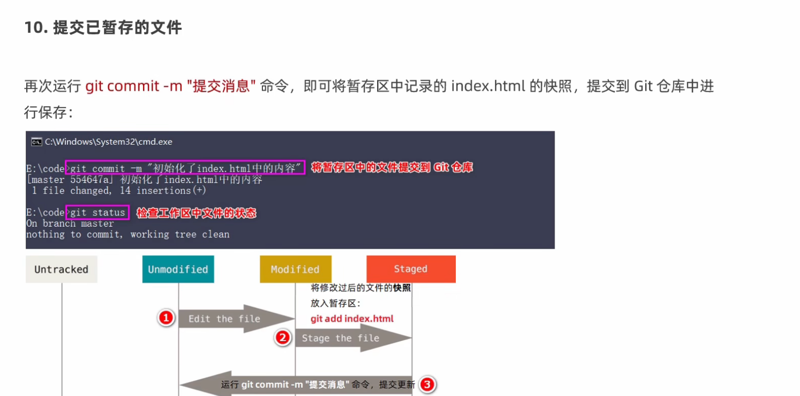
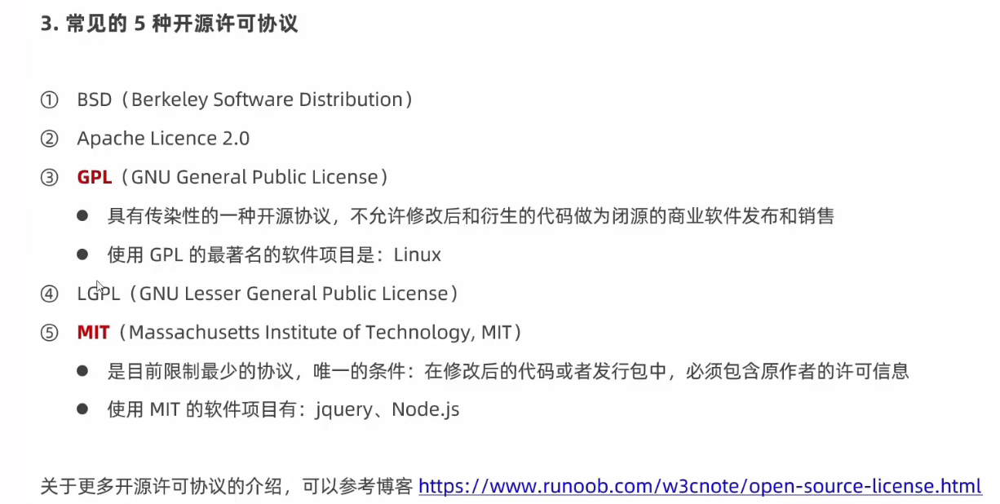
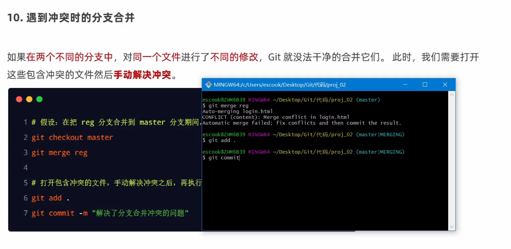

>能够掌握Git 基本命令的使用
>能够使用Github创建和维护远程仓库
>能够掌握Git分支的基本使用
[toc]

# 起步
## 版本控制
1. 文件的版本


## 基础概念


# git 基础
## 安装
- 下载地址：https://git-scm.com/download
>Git GUI：Git提供的图形界面工具
Git Bash：Git提供的命令行工具
## 配置
1.打开Git Bash
2.设置用户名及用户邮箱
>写入到C:/Users/用户名文件夹l.gitconfig文件中。这个文件是Git的全局配置文件
配置一次即可永久生效。
- 设置用户名（英文）
```bash
git config --global user.name “username”
```
- 设置用户邮箱
```bash
git config --global user.email “useremail”
```
3.查看配置信息
- 查看用户名
```bash
git config --global user.name
```
- 查看邮箱
```bash
git config --global user.email
```
- 查看所有
```bash
git config --list  --global 
``` 
4.获取帮助
```bash
git config -h  
git help  config  
``` 
5.解决Git Bash乱码问题
[跳转](https://blog.csdn.net/seimeii/article/details/122713965?ops_request_misc=%257B%2522request%255Fid%2522%253A%2522166141487716782388078449%2522%252C%2522scm%2522%253A%252220140713.130102334..%2522%257D&request_id=166141487716782388078449&biz_id=0&utm_medium=distribute.pc_search_result.none-task-blog-2~all~sobaiduend~default-1-122713965-null-null.142^v42^pc_rank_34_1,185^v2^control&utm_term=git%E4%B8%AD%E6%96%87%E4%B9%B1%E7%A0%81&spm=1018.2226.3001.4187)
## 基本操作


### 1. 获取仓库的两种方式


### 2. git中文件的状态


### 3. 跟踪文件&提交更新
跟踪文件

提交更新


修改更新



撤销取消


### 4. 移除文件


### 5. 忽略文件


###  6. 查看提交文件


### 7. 回退到指定版本


# github
## 开源





## github

## 远程仓库的使用
1. 介绍


2. https

3. ssh

```git
ssh-keygen -t rsa -b 4096 -C "3255988713@qq.com"
```

```git
 ssh -T git@github.com
```


## 分支
### 1. 介绍


### 2. 查看—创建-切换


### 3. 合并—删除-解决冲突



### 4. 推送到远程仓库


### 5.跟踪、拉取、删除远程分支


#总结

